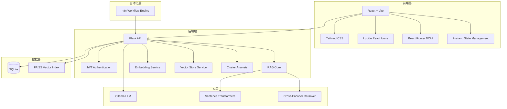
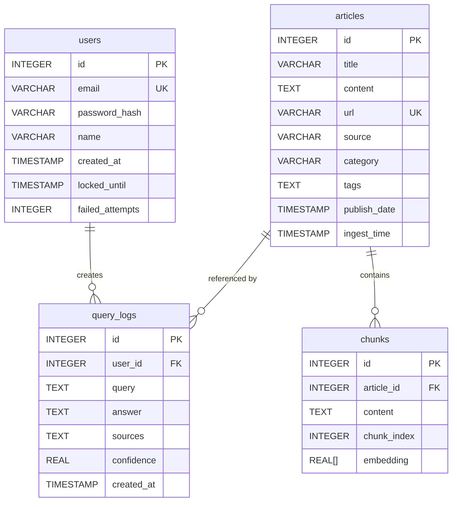

# XU-News-AI-RAG 技术架构文档

**版本**: v1.0  
**创建日期**: 2026-07-11  
**依据**: [PRD_ASSESSMENT.md](file:///d:/homework/8/homework8/xu-ai-news-rag/docs/PRD_ASSESSMENT.md)

---

## 1. 架构设计



---

## 2. 技术栈描述

| 层级 | 技术 | 版本 | 用途 |
|------|------|------|------|
| **前端框架** | React | 18 | 用户界面开发 |
| **构建工具** | Vite | 6 | 快速构建和热更新 |
| **样式框架** | Tailwind CSS | 3 | 原子化CSS样式 |
| **图标库** | Lucide React | 0.452 | 图标组件 |
| **路由** | React Router DOM | 6 | 页面路由管理 |
| **状态管理** | Zustand | 4 | 全局状态管理 |
| **HTTP客户端** | Axios | 1 | API请求 |
| **后端框架** | Flask | 3 | RESTful API服务 |
| **认证** | JWT | - | 用户身份验证 |
| **向量数据库** | FAISS | 1 | 语义检索 |
| **LLM** | Ollama | - | 本地大语言模型 |
| **Embedding** | SentenceTransformers | 3 | 文本向量化 |
| **Reranker** | Cross-Encoder | - | 结果重排序 |
| **数据库** | SQLite | - | 元数据存储 |
| **工作流** | n8n | - | 自动化数据采集 |

---

## 3. 路由定义

| 路由 | 页面组件 | 权限要求 | 描述 |
|------|---------|---------|------|
| `/` | Login | 无 | 登录页面 |
| `/register` | Register | 无 | 注册页面 |
| `/dashboard` | Dashboard | 已登录 | 仪表盘首页 |
| `/query` | Query | 已登录 | 智能问答页面 |
| `/news` | News | 已登录 | 新闻管理页面 |
| `/ingest` | Ingest | 已登录 | 数据入库页面 |
| `/reports` | Reports | 已登录 | 分析报告页面 |
| `/settings` | Settings | 已登录 | 系统设置页面 |

---

## 4. API 定义

### 4.1 认证 API

| 方法 | 路径 | 描述 |
|------|------|------|
| POST | `/api/auth/register` | 用户注册 |
| POST | `/api/auth/login` | 用户登录 |
| POST | `/api/auth/refresh` | Token 刷新 |
| GET | `/api/auth/me` | 获取当前用户信息 |

### 4.2 入库 API

| 方法 | 路径 | 描述 |
|------|------|------|
| POST | `/api/ingest/structured` | 结构化数据入库 |
| POST | `/api/ingest/unstructured` | 非结构化数据入库 |

### 4.3 搜索 API

| 方法 | 路径 | 描述 |
|------|------|------|
| POST | `/api/ask` | RAG 智能问答 |

### 4.4 新闻管理 API

| 方法 | 路径 | 描述 |
|------|------|------|
| GET | `/api/news` | 获取新闻列表 |
| GET | `/api/news/:id` | 获取新闻详情 |
| PUT | `/api/news/:id` | 更新新闻 |
| DELETE | `/api/news/:id` | 删除新闻 |

### 4.5 报告 API

| 方法 | 路径 | 描述 |
|------|------|------|
| GET | `/api/report/clusters` | 获取聚类分析 |
| GET | `/api/report/topkeywords` | 获取关键词统计 |

---

## 5. 数据模型

### 5.1 ER 图



### 5.2 DDL 语句

```sql
CREATE TABLE users (
    id INTEGER PRIMARY KEY AUTOINCREMENT,
    email VARCHAR(255) UNIQUE NOT NULL,
    password_hash VARCHAR(255) NOT NULL,
    name VARCHAR(100),
    created_at TIMESTAMP DEFAULT CURRENT_TIMESTAMP,
    locked_until TIMESTAMP,
    failed_attempts INTEGER DEFAULT 0
);

CREATE TABLE articles (
    id INTEGER PRIMARY KEY AUTOINCREMENT,
    title VARCHAR(500) NOT NULL,
    content TEXT,
    url VARCHAR(500) UNIQUE,
    source VARCHAR(100),
    category VARCHAR(50),
    tags TEXT,
    publish_date TIMESTAMP,
    ingest_time TIMESTAMP DEFAULT CURRENT_TIMESTAMP
);

CREATE TABLE chunks (
    id INTEGER PRIMARY KEY AUTOINCREMENT,
    article_id INTEGER REFERENCES articles(id),
    content TEXT,
    chunk_index INTEGER,
    embedding BLOB
);

CREATE TABLE query_logs (
    id INTEGER PRIMARY KEY AUTOINCREMENT,
    user_id INTEGER REFERENCES users(id),
    query TEXT NOT NULL,
    answer TEXT,
    sources TEXT,
    confidence REAL,
    created_at TIMESTAMP DEFAULT CURRENT_TIMESTAMP
);
```

---

## 6. 页面组件结构

```
src/
├── components/
│   ├── Layout/
│   │   ├── Header.tsx
│   │   ├── Sidebar.tsx
│   │   └── MainLayout.tsx
│   ├── UI/
│   │   ├── Button.tsx
│   │   ├── Input.tsx
│   │   ├── Card.tsx
│   │   ├── Badge.tsx
│   │   └── Loading.tsx
│   ├── Dashboard/
│   │   ├── StatCard.tsx
│   │   ├── NewsPreview.tsx
│   │   └── QuickActions.tsx
│   ├── Query/
│   │   ├── QuestionInput.tsx
│   │   ├── AnswerDisplay.tsx
│   │   └── SourceList.tsx
│   ├── News/
│   │   ├── NewsTable.tsx
│   │   ├── NewsForm.tsx
│   │   └── NewsFilter.tsx
│   ├── Reports/
│   │   ├── ClusterChart.tsx
│   │   ├── KeywordChart.tsx
│   │   └── ReportExport.tsx
│   └── Ingest/
│       ├── DataUploader.tsx
│       └── IngestProgress.tsx
├── pages/
│   ├── Login.tsx
│   ├── Register.tsx
│   ├── Dashboard.tsx
│   ├── Query.tsx
│   ├── News.tsx
│   ├── Ingest.tsx
│   ├── Reports.tsx
│   └── Settings.tsx
├── stores/
│   └── auth.ts
├── services/
│   └── api.ts
├── utils/
│   └── helpers.ts
└── App.tsx
```

---

## 7. 设计规范

### 7.1 色彩方案

| 颜色 | 用途 | Hex |
|------|------|-----|
| Primary | 主色调 | #3B82F6 |
| Primary Dark | 悬停状态 | #2563EB |
| Secondary | 辅助色 | #6366F1 |
| Success | 成功状态 | #10B981 |
| Warning | 警告状态 | #F59E0B |
| Error | 错误状态 | #EF4444 |
| Info | 信息状态 | #0EA5E9 |
| Background | 页面背景 | #F8FAFC |
| Surface | 卡片背景 | #FFFFFF |
| Text Primary | 主要文字 | #1E293B |
| Text Secondary | 次要文字 | #64748B |
| Border | 边框颜色 | #E2E8F0 |

### 7.2 字体规范

| 字体 | 大小 | 用途 |
|------|------|------|
| Heading 1 | 2rem / 32px | 页面标题 |
| Heading 2 | 1.5rem / 24px | 区块标题 |
| Heading 3 | 1.25rem / 20px | 卡片标题 |
| Body | 1rem / 16px | 正文内容 |
| Small | 0.875rem / 14px | 辅助文字 |
| Caption | 0.75rem / 12px | 说明文字 |

### 7.3 间距规范

| 间距 | 大小 | 用途 |
|------|------|------|
| xs | 0.25rem / 4px | 微小间距 |
| sm | 0.5rem / 8px | 小间距 |
| md | 1rem / 16px | 中等间距 |
| lg | 1.5rem / 24px | 大间距 |
| xl | 2rem / 32px | 超大间距 |

---

## 8. 状态管理

### 8.1 Auth Store

```typescript
interface AuthState {
  user: User | null;
  token: string | null;
  isAuthenticated: boolean;
  loading: boolean;
}

interface User {
  id: number;
  email: string;
  name: string;
  created_at: string;
}
```

### 8.2 Actions

| Action | 描述 |
|--------|------|
| login(email, password) | 用户登录 |
| register(email, password, name) | 用户注册 |
| logout() | 用户登出 |
| refreshToken() | 刷新 Token |
| setUser(user) | 设置用户信息 |

---

## 9. API 服务层

### 9.1 ApiService 类

| 方法 | 描述 |
|------|------|
| auth.register(data) | 注册用户 |
| auth.login(data) | 用户登录 |
| auth.me() | 获取当前用户 |
| ingest.structured(data) | 结构化数据入库 |
| ingest.unstructured(data) | 非结构化数据入库 |
| search.ask(query) | RAG 问答 |
| news.list(params) | 获取新闻列表 |
| news.get(id) | 获取新闻详情 |
| news.update(id, data) | 更新新闻 |
| news.delete(id) | 删除新闻 |
| reports.clusters() | 获取聚类分析 |
| reports.topKeywords(params) | 获取关键词统计 |

---

## 10. 部署配置

### 10.1 环境变量

| 变量名 | 描述 | 默认值 |
|--------|------|--------|
| VITE_API_BASE_URL | 后端 API 地址 | http://localhost:5000 |
| VITE_OLLAMA_HOST | Ollama 服务地址 | http://localhost:11434 |

### 10.2 端口配置

| 服务 | 端口 |
|------|------|
| 前端 | 3000 |
| 后端 | 5000 |
| Ollama | 11434 |
| n8n | 5678 |

---

**文档状态**: ✅ 待评审  
**最后更新**: 2026-07-11