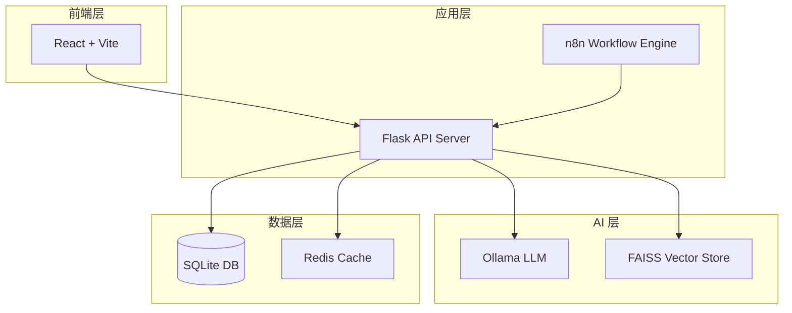

# XU-News-AI-RAG

[](LICENSE)
[](https://www.python.org/)
[](https://nodejs.org/)
[](https://www.docker.com/)

> **新闻智能检索与问答系统** - 基于 RAG（检索增强生成）技术，结合本地大语言模型（Ollama），实现智能新闻检索、问答、聚类分析与热点发现。

---

## 📋 目录

- [项目简介](#项目简介)
- [核心功能](#核心功能)
- [技术架构](#技术架构)
- [快速开始](#快速开始)
- [项目结构](#项目结构)
- [文档导航](#文档导航)
- [开发指南](#开发指南)
- [部署说明](#部署说明)
- [常见问题](#常见问题)
- [贡献指南](#贡献指南)
- [许可证](#许可证)

---

## 🎯 项目简介

XU-News-AI-RAG 是一个基于 RAG（Retrieval-Augmented Generation）技术的新闻智能问答系统。通过自动化爬取新闻、向量化存储、语义检索与大语言模型生成，实现以下能力：

- 🤖 **智能问答**: 通过自然语言提问，获取基于新闻内容的精准答案
- 🔍 **语义检索**: 基于向量相似度的智能检索，相比传统关键词搜索更智能
- 📊 **聚类分析**: 自动发现新闻热点与主题趋势
- 🔄 **回退搜索**: 本地检索不足时，自动调用百度搜索补充
- 📈 **关键词统计**: 实时热门关键词 Top10 统计

---

## ✨ 核心功能

### 1️⃣ 自动化新闻采集

- 基于 n8n 工作流，定时爬取新闻
- 遵循 robots.txt 与速率限制，合法合规
- 自动去重、数据清洗与标准化

### 2️⃣ RAG 问答

```
用户: "最近关于 AI 的新闻有哪些？"

系统:
根据检索到的新闻，最近关于 AI 的主要动态包括：
1. OpenAI 发布 GPT-5 模型，性能大幅提升...
2. 百度发布文心一言 4.0，支持多模态输入...

来源:
- [OpenAI 发布 GPT-5](https://example.com/news/gpt5)
- [百度发布文心一言 4.0](https://example.com/news/wenxin)
```

### 3️⃣ 聚类分析

- 自动对新闻进行主题聚类（K-Means/DBSCAN）
- 生成主题标签与关键词
- 可视化展示（t-SNE 降维 + 散点图）

### 4️⃣ 关键词统计

- 实时热门关键词 Top10
- 支持按日/周/月维度统计
- 趋势分析与可视化

---

## 🏗️ 技术架构

### 架构图



### 技术栈

**前端**:

- React 18 + Vite
- TypeScript
- TailwindCSS
- Zustand (状态管理)
- Axios

**后端**:

- Python 3.11+
- Flask 3.x
- LangChain
- FAISS (向量检索)
- SQLite / PostgreSQL
- Celery (异步任务)

**AI 组件**:

- Ollama (本地 LLM)
- mxbai-embed-large (Embedding 模型)
- qwen2.5 / llama3.1 (LLM 模型)

**工作流**:

- n8n (自动化爬虫)

**基础设施**:

- Docker & Docker Compose
- Nginx
- Redis (可选)

---

## 🚀 快速开始

### 前置要求

- **Python** 3.11+
- **Node.js** 18+
- **Ollama** (本地 LLM 引擎)
- **Docker** (可选，推荐用于生产部署)

### 方式一: 一键启动脚本（推荐）

#### Windows

```bash
git clone https://github.com/your-org/xu-news-ai-rag.git
cd xu-news-ai-rag

# 初始化环境
.\scripts\init.bat

# 启动所有服务
.\scripts\dev.bat
```

#### Linux/Mac

```bash
git clone https://github.com/your-org/xu-news-ai-rag.git
cd xu-news-ai-rag

# 赋予脚本执行权限
chmod +x scripts/*.sh

# 初始化环境
./scripts/init.sh

# 启动所有服务
./scripts/dev.sh
```

### 方式二: Docker Compose（推荐用于生产）

```bash
# 复制环境变量模板
cp .env.example .env
# 编辑 .env，填入必要配置（如 JWT_SECRET）

# 启动所有服务
docker-compose up -d

# 查看服务状态
docker-compose ps

# 查看日志
docker-compose logs -f
```

**访问地址**:

- 前端: http://localhost:3000
- 后端 API: http://localhost:5000
- n8n: http://localhost:5678
- Ollama: http://localhost:11434

---

### 方式三: 手动安装

#### 1. 安装 Ollama

**下载与安装**:

- Windows: https://ollama.ai/download/windows
- Linux/Mac: `curl -fsSL https://ollama.ai/install.sh | sh`

**拉取模型**:

```bash
# Embedding 模型（必需）
ollama pull mxbai-embed-large

# LLM 模型（二选一）
ollama pull qwen2.5:7b       # 中文优化，推荐
# 或
ollama pull llama3.1:8b      # 综合性能
```

#### 2. 后端安装

```bash
cd backend

# 创建虚拟环境
python -m venv venv
source venv/bin/activate  # Linux/Mac
# venv\Scripts\activate   # Windows

# 安装依赖
pip install -r requirements.txt

# 配置环境变量
cp ../.env.example .env
# 编辑 .env，填入配置

# 初始化数据库
python manage.py init-db

# 创建管理员账户
python manage.py create-admin --email admin@example.com --password Admin123

# 启动服务
python run.py
```

#### 3. 前端安装

```bash
cd frontend

# 安装依赖
npm install

# 配置环境变量
cp .env.example .env.local
# 编辑 .env.local，设置 VITE_API_BASE_URL=http://localhost:5000

# 启动服务
npm run dev
```

#### 4. n8n 安装

```bash
# Docker 方式
docker run -d \
  --name n8n \
  -p 5678:5678 \
  -v ~/.n8n:/home/node/.n8n \
  n8nio/n8n

# 或 NPX 方式
npx n8n
```

**导入工作流**:

1. 访问 http://localhost:5678
2. 导入 `workflows/news_crawler_workflow.json`
3. 配置 Backend API Endpoint 与 API Key
4. 激活工作流

---

## 📁 项目结构

```
XU-News-AI-RAG/
├── frontend/                 # React 前端
│   ├── src/
│   │   ├── components/       # 可复用组件
│   │   ├── pages/            # 页面组件
│   │   ├── services/         # API 服务
│   │   ├── store/            # 状态管理
│   │   └── App.tsx
│   ├── package.json
│   └── vite.config.ts
│
├── backend/                  # Flask 后端
│   ├── app/
│   │   ├── api/              # API 路由
│   │   ├── models/           # 数据模型
│   │   ├── services/         # 业务逻辑
│   │   ├── rag/              # RAG 相关模块
│   │   └── config/           # 配置文件
│   ├── tests/                # 测试文件
│   ├── requirements.txt
│   └── run.py
│
├── workflows/                # n8n 工作流
│   ├── news_crawler_workflow.json
│   └── README.md
│
├── docs/                     # 文档目录
│   ├── PRD.md                # 产品需求文档
│   ├── ARCHITECTURE.md       # 系统架构设计
│   ├── DATA_DESIGN.md        # 数据设计
│   ├── API_SPEC.md           # API 规范
│   ├── TEST_PLAN.md          # 测试计划
│   ├── SECURITY_COMPLIANCE.md  # 安全合规
│   └── OPS_GUIDE.md          # 运维指南
│
├── scripts/                  # 一键脚本
│   ├── init.sh / init.bat    # 初始化
│   ├── dev.sh / dev.bat      # 开发环境启动
│   ├── build.sh / build.bat  # 构建
│   ├── test.sh / test.bat    # 测试
│   └── backup.sh             # 备份
│
├── infra/                    # 基础设施
│   ├── docker-compose.yml
│   ├── Dockerfile.backend
│   ├── Dockerfile.frontend
│   └── nginx.conf
│
├── .env.example              # 环境变量模板
├── .gitignore
└── README.md                 # 本文件
```

---

## 📚 文档导航

| 文档                                                  | 描述                                       |
| ----------------------------------------------------- | ------------------------------------------ |
| [PRD.md](docs/PRD.md)                                 | 产品需求文档：用户故事、功能需求、验收标准 |
| [ARCHITECTURE.md](docs/ARCHITECTURE.md)               | 系统架构设计：架构图、模块职责、数据流     |
| [DATA_DESIGN.md](docs/DATA_DESIGN.md)                 | 数据设计：SQLite 表结构、FAISS 索引设计    |
| [API_SPEC.md](docs/API_SPEC.md)                       | API 规范：OpenAPI 3.0、接口文档            |
| [TEST_PLAN.md](docs/TEST_PLAN.md)                     | 测试计划：单元测试、集成测试、性能测试     |
| [SECURITY_COMPLIANCE.md](docs/SECURITY_COMPLIANCE.md) | 安全合规：爬虫规范、认证鉴权、防护机制     |
| [OPS_GUIDE.md](docs/OPS_GUIDE.md)                     | 运维指南：部署、监控、故障排查             |

---

## 🛠️ 开发指南

### 开发环境启动

```bash
# 后端
cd backend
source venv/bin/activate
python run.py

# 前端
cd frontend
npm run dev

# n8n
docker run -d -p 5678:5678 n8nio/n8n
```

### 运行测试

```bash
# 后端单元测试
cd backend
pytest tests/ -v --cov=app

# 后端集成测试
pytest tests/integration/ -v

# 前端测试
cd frontend
npm run test
```

### 代码检查

```bash
# 后端 Lint
cd backend
flake8 app/
black app/ --check

# 前端 Lint
cd frontend
npm run lint
```

### 构建生产版本

```bash
# 前端
cd frontend
npm run build

# 后端（Docker）
cd backend
docker build -t xu-news-backend .
```

---

## 🚢 部署说明

### Docker Compose 部署（推荐）

```bash
# 1. 配置环境变量
cp .env.example .env
# 编辑 .env，修改以下配置：
# - JWT_SECRET: 随机生成 32 位字符串
# - OLLAMA_HOST: http://ollama:11434
# - DATABASE_URL: 根据实际配置

# 2. 构建镜像
docker-compose build

# 3. 启动服务
docker-compose up -d

# 4. 查看日志
docker-compose logs -f

# 5. 访问
# 前端: http://your-domain:3000
# 后端: http://your-domain:5000
```

### Nginx 反向代理

```nginx
server {
    listen 80;
    server_name xu-news.com;

    # 前端
    location / {
        proxy_pass http://localhost:3000;
    }

    # 后端 API
    location /api/ {
        proxy_pass http://localhost:5000;
        proxy_set_header Host $host;
        proxy_set_header X-Real-IP $remote_addr;
    }
}
```

### HTTPS 配置

```bash
# 使用 Certbot 申请免费 SSL 证书
certbot --nginx -d xu-news.com
```

---

## ❓ 常见问题

### Q1: Ollama 连接失败？

**A**:

1. 确认 Ollama 已启动: `curl http://localhost:11434/api/version`
2. 检查环境变量 `OLLAMA_HOST` 是否正确
3. 如果使用 Docker，确认网络配置正确

### Q2: FAISS 索引为空，检索无结果？

**A**:

1. 确认已执行新闻入库: 查看 `backend/data/faiss_indexes/news_vectors.index`
2. 检查 Ollama Embedding 模型是否已拉取: `ollama list`
3. 手动触发入库测试: `python manage.py test-ingest`

### Q3: RAG 答案质量差？

**A**:

1. 增加检索数量 (`top_k=10`)
2. 启用回退搜索 (`enable_fallback=true`)
3. 增加新闻数据量（至少 1000 条以上）
4. 更换更强的 LLM 模型（如 `llama3.1:70b`）

### Q4: 如何备份数据？

**A**:

```bash
# 执行备份脚本
./scripts/backup.sh

# 手动备份
cp -r backend/data backups/data_$(date +%Y%m%d)
```

### Q5: 如何增加新闻源？

**A**:

1. 登录 n8n (http://localhost:5678)
2. 编辑 `news_crawler_workflow`
3. 添加新的 HTTP Request 节点，配置目标网站
4. 配置 HTML Extract 节点，提取标题、正文等字段
5. 保存并激活工作流

---

## 🤝 贡献指南

我们欢迎所有形式的贡献！

### 贡献流程

1. Fork 本仓库
2. 创建特性分支 (`git checkout -b feature/amazing-feature`)
3. 提交更改 (`git commit -m 'Add some amazing feature'`)
4. 推送到分支 (`git push origin feature/amazing-feature`)
5. 创建 Pull Request

### 代码规范

- **Python**: 遵循 PEP 8，使用 `black` 格式化
- **TypeScript**: 遵循 Airbnb 规范，使用 `prettier` 格式化
- **提交信息**: 使用语义化提交（Conventional Commits）

### 测试要求

- 所有新功能需包含单元测试
- 测试覆盖率 > 80%
- 所有测试通过后才能合并

---

## 📄 许可证

本项目采用 MIT 许可证 - 详见 [LICENSE](LICENSE) 文件

---

## 📧 联系我们

- **项目维护者**: XU-News-AI-RAG Team
- **邮箱**: contact@xu-news.com
- **官网**: https://xu-news.com
- **GitHub Issues**: https://github.com/your-org/xu-news-ai-rag/issues

---

## 🌟 Star History

如果这个项目对你有帮助，请给我们一个 Star ⭐！

[](https://star-history.com/#your-org/xu-news-ai-rag&Date)

---

## 🙏 致谢

感谢以下开源项目:

- [LangChain](https://github.com/langchain-ai/langchain)
- [FAISS](https://github.com/facebookresearch/faiss)
- [Ollama](https://github.com/ollama/ollama)
- [n8n](https://github.com/n8n-io/n8n)
- [Flask](https://github.com/pallets/flask)
- [React](https://github.com/facebook/react)

---

**版本**: v1.0.0  
**最后更新**: 2026-6-30
