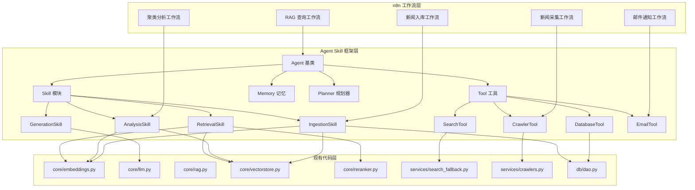
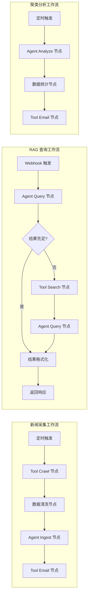

# XU-News-AI-RAG Agent Skill 框架改造方案

**版本**: v1.0  
**创建日期**: 2026-07-11  
**依据**: [考核项目要求.txt](file:///d:/homework/8/homework8/xu-ai-news-rag/考核项目要求.txt)

---

## 1. 需求分析

### 1.1 考核要求原文

> **开发框架 Agent Skill 统一开发规范、智能代理能力封装**
>
> 技术实现要点：
>
> 1. 技术栈选型：前端 React/Vue，后端 Flask，关系库 MySQL/SQLite，向量库 FAISS；核心流程由 n8n 自动化编排，基于 Agent Skill 框架开发。
> 2. 数据存储设计：元数据存入关系型数据库；向量数据 FAISS；n8n 通过数据库节点与自定义 FAISS 节点实现数据读写同步。
> 3. 工作流集成：数据采集、入库、查询、分析、通知等核心逻辑全部用 n8n 工作流实现，低代码完成异构系统联动。
> 4. 大模型调用：通过 n8n HTTP 节点灵活调整。

### 1.2 当前项目问题

| 问题                 | 描述                                       | 影响                       |
| -------------------- | ------------------------------------------ | -------------------------- |
| 无 Agent Skill 框架  | 后端代码为传统 Flask 应用，无 Agent 抽象层 | 无法实现智能代理能力封装   |
| n8n 工作流与后端耦合 | n8n 直接调用后端 API，无统一 Agent 接口    | 低代码编排能力受限         |
| 缺少 Skill 模块化    | AI 能力分散在 core/ 目录，无统一封装       | 无法实现能力复用和扩展     |
| 无工具调用层         | 外部工具（搜索、爬虫）直接在服务层调用     | 无法实现工具选择和规划     |
| 无记忆管理           | 查询历史仅存储在数据库，无 Agent 记忆      | 无法实现上下文对话和个性化 |

---

## 2. Agent Skill 框架架构设计

### 2.1 框架核心概念



### 2.2 目录结构改造

```
backend/
├── agent/                              # Agent Skill 框架层（新增）
│   ├── __init__.py
│   ├── base_agent.py                   # Agent 基类
│   ├── memory.py                       # 记忆管理
│   ├── planner.py                      # 规划器
│   ├── skills/                         # Skill 模块
│   │   ├── __init__.py
│   │   ├── retrieval_skill.py          # 检索 Skill
│   │   ├── generation_skill.py         # 生成 Skill
│   │   ├── analysis_skill.py           # 分析 Skill
│   │   └── ingestion_skill.py          # 入库 Skill
│   └── tools/                          # Tool 工具
│       ├── __init__.py
│       ├── search_tool.py              # 搜索工具
│       ├── crawler_tool.py             # 爬虫工具
│       ├── database_tool.py            # 数据库工具
│       └── email_tool.py               # 邮件工具
├── apis/                               # API 路由（改造）
│   ├── agent_api.py                    # Agent 统一接口（新增）
│   ├── health.py
│   ├── ingest.py
│   ├── search.py
│   └── reports.py
├── core/                               # 核心模块（保留，作为底层实现）
│   ├── embeddings.py
│   ├── llm.py
│   ├── rag.py
│   ├── reranker.py
│   └── vectorstore.py
├── db/                                 # 数据库（保留）
│   ├── dao.py
│   ├── models.py
│   └── schema.sql
├── auth/                               # 认证（保留）
│   └── jwt.py
├── services/                           # 服务层（降级为工具实现）
│   ├── crawlers.py
│   └── search_fallback.py
└── app.py                              # 应用入口（改造）
```

### 2.3 核心类设计

#### 2.3.1 Agent 基类 (`agent/base_agent.py`)

```python
class BaseAgent:
    """Agent 基类：定义智能代理的基本行为"""

    def __init__(self):
        self.skills = {}              # 注册的 Skill 字典
        self.tools = {}               # 注册的 Tool 字典
        self.memory = None            # 记忆管理器
        self.planner = None           # 规划器

    def register_skill(self, name: str, skill):
        """注册 Skill"""
        self.skills[name] = skill

    def register_tool(self, name: str, tool):
        """注册 Tool"""
        self.tools[name] = tool

    async def execute(self, task: str, context: dict = None) -> dict:
        """执行任务：规划 → 调用 Skill/Tool → 返回结果"""
        pass

    def get_memory(self) -> dict:
        """获取记忆"""
        pass

    def update_memory(self, key: str, value):
        """更新记忆"""
        pass
```

#### 2.3.2 NewsAgent 实现类

```python
class NewsAgent(BaseAgent):
    """新闻智能代理：封装 RAG 检索、生成、分析能力"""

    def __init__(self):
        super().__init__()
        # 注册核心 Skill
        self.register_skill('retrieval', RetrievalSkill())
        self.register_skill('generation', GenerationSkill())
        self.register_skill('analysis', AnalysisSkill())
        self.register_skill('ingestion', IngestionSkill())
        # 注册工具
        self.register_tool('search', SearchTool())
        self.register_tool('crawler', CrawlerTool())
        self.register_tool('database', DatabaseTool())
        self.register_tool('email', EmailTool())
        # 初始化记忆和规划器
        self.memory = NewsMemory()
        self.planner = NewsPlanner()

    async def answer_question(self, question: str, user_id: int = None) -> dict:
        """回答用户问题（核心 RAG 流程）"""
        pass

    async def analyze_clusters(self, time_range: str = 'weekly') -> dict:
        """执行聚类分析"""
        pass

    async def ingest_news(self, news_data: list) -> dict:
        """入库新闻数据"""
        pass
```

---

## 3. Skill 模块设计

### 3.1 RetrievalSkill (`agent/skills/retrieval_skill.py`)

| 方法            | 描述                    | 参数                          | 返回值       |
| --------------- | ----------------------- | ----------------------------- | ------------ |
| `search`        | 语义检索                | `query`, `top_k`, `threshold` | 检索结果列表 |
| `rerank`        | 结果重排序              | `query`, `candidates`         | 重排序结果   |
| `hybrid_search` | 混合检索（向量+关键词） | `query`, `top_k`              | 混合结果     |

### 3.2 GenerationSkill (`agent/skills/generation_skill.py`)

| 方法               | 描述       | 参数                                 | 返回值     |
| ------------------ | ---------- | ------------------------------------ | ---------- |
| `generate`         | 生成答案   | `prompt`, `context`, `system_prompt` | 生成文本   |
| `summarize`        | 文本摘要   | `text`, `max_length`                 | 摘要文本   |
| `extract_keywords` | 关键词提取 | `text`, `top_n`                      | 关键词列表 |

### 3.3 AnalysisSkill (`agent/skills/analysis_skill.py`)

| 方法                 | 描述         | 参数                    | 返回值     |
| -------------------- | ------------ | ----------------------- | ---------- |
| `cluster_analysis`   | K-Means 聚类 | `data`, `n_clusters`    | 聚类结果   |
| `keyword_statistics` | 关键词统计   | `time_range`, `top_n`   | 关键词统计 |
| `trend_analysis`     | 趋势分析     | `keyword`, `time_range` | 趋势数据   |

### 3.4 IngestionSkill (`agent/skills/ingestion_skill.py`)

| 方法                  | 描述             | 参数                  | 返回值   |
| --------------------- | ---------------- | --------------------- | -------- |
| `ingest_structured`   | 结构化数据入库   | `data`, `source`      | 入库结果 |
| `ingest_unstructured` | 非结构化数据入库 | `text`, `source`      | 入库结果 |
| `batch_ingest`        | 批量入库         | `data_list`, `source` | 批量结果 |
| `deduplicate`         | 去重检测         | `url`, `content_hash` | 是否重复 |

---

## 4. Tool 工具设计

### 4.1 SearchTool (`agent/tools/search_tool.py`)

| 方法           | 描述           | 参数                   | 返回值   |
| -------------- | -------------- | ---------------------- | -------- |
| `search_baidu` | 百度搜索       | `query`, `num_results` | 搜索结果 |
| `search_rss`   | RSS 订阅解析   | `rss_url`              | RSS 条目 |
| `search_local` | 本地知识库检索 | `query`, `top_k`       | 检索结果 |

### 4.2 CrawlerTool (`agent/tools/crawler_tool.py`)

| 方法              | 描述            | 参数              | 返回值       |
| ----------------- | --------------- | ----------------- | ------------ |
| `crawl_page`      | 抓取网页        | `url`, `selector` | 网页内容     |
| `check_robots`    | 检查 robots.txt | `url`             | 是否允许抓取 |
| `extract_content` | 提取正文        | `html`, `url`     | 正文内容     |

### 4.3 DatabaseTool (`agent/tools/database_tool.py`)

| 方法     | 描述     | 参数                     | 返回值   |
| -------- | -------- | ------------------------ | -------- |
| `query`  | 查询数据 | `sql`, `params`          | 查询结果 |
| `insert` | 插入数据 | `table`, `data`          | 插入结果 |
| `update` | 更新数据 | `table`, `data`, `where` | 更新结果 |
| `delete` | 删除数据 | `table`, `where`         | 删除结果 |

### 4.4 EmailTool (`agent/tools/email_tool.py`)

| 方法                | 描述     | 参数                                | 返回值   |
| ------------------- | -------- | ----------------------------------- | -------- |
| `send_email`        | 发送邮件 | `to`, `subject`, `body`, `template` | 是否成功 |
| `send_notification` | 发送通知 | `type`, `data`                      | 是否成功 |
| `send_report`       | 发送报告 | `to`, `report_data`, `format`       | 是否成功 |

---

## 5. Memory 与 Planner 设计

### 5.1 NewsMemory (`agent/memory.py`)

| 方法                  | 描述         | 参数                         | 返回值   |
| --------------------- | ------------ | ---------------------------- | -------- |
| `get_conversation`    | 获取对话历史 | `user_id`, `limit`           | 对话记录 |
| `add_message`         | 添加消息     | `user_id`, `role`, `content` | 是否成功 |
| `clear_conversation`  | 清空对话     | `user_id`                    | 是否成功 |
| `get_user_profile`    | 获取用户画像 | `user_id`                    | 用户偏好 |
| `update_user_profile` | 更新用户画像 | `user_id`, `preferences`     | 是否成功 |

### 5.2 NewsPlanner (`agent/planner.py`)

| 方法           | 描述         | 参数                       | 返回值     |
| -------------- | ------------ | -------------------------- | ---------- |
| `plan`         | 规划执行步骤 | `task`, `agent`            | 步骤列表   |
| `select_tool`  | 选择工具     | `task`, `available_tools`  | 工具名称   |
| `select_skill` | 选择 Skill   | `task`, `available_skills` | Skill 名称 |
| `execute_plan` | 执行规划     | `plan`, `agent`            | 执行结果   |

---

## 6. API 改造方案

### 6.1 新增 Agent 统一接口

| 方法   | 路径                 | 描述               |
| ------ | -------------------- | ------------------ |
| POST   | `/api/agent/query`   | Agent 统一查询接口 |
| POST   | `/api/agent/analyze` | Agent 分析接口     |
| POST   | `/api/agent/ingest`  | Agent 入库接口     |
| GET    | `/api/agent/memory`  | 获取 Agent 记忆    |
| DELETE | `/api/agent/memory`  | 清空 Agent 记忆    |

### 6.2 Agent Query 接口设计

**请求**:

```json
{
    "task": "回答问题",
    "question": "最近关于人工智能的新闻有哪些？",
    "user_id": 1,
    "context": {
        "conversation_history": [...],
        "preferences": {"language": "zh"}
    },
    "options": {
        "enable_fallback": true,
        "top_k": 5
    }
}
```

**响应**:

```json
{
    "code": 0,
    "data": {
        "answer": "根据知识库内容，最近关于人工智能的新闻包括...",
        "sources": [...],
        "plan": ["检索知识库", "重排序", "生成答案"],
        "execution_time": 2.3,
        "memory_updated": true
    },
    "message": "success"
}
```

---

## 7. n8n 工作流改造

### 7.1 新增 Agent 节点

| 节点名称      | 描述                    | 用途               |
| ------------- | ----------------------- | ------------------ |
| Agent Query   | 调用 Agent 统一查询接口 | RAG 问答工作流     |
| Agent Analyze | 调用 Agent 分析接口     | 聚类分析工作流     |
| Agent Ingest  | 调用 Agent 入库接口     | 新闻入库工作流     |
| Tool Search   | 调用搜索工具            | 回退搜索工作流     |
| Tool Crawl    | 调用爬虫工具            | 新闻采集工作流     |
| Memory Read   | 读取 Agent 记忆         | 个性化推荐工作流   |
| Memory Write  | 写入 Agent 记忆         | 用户画像更新工作流 |

### 7.2 改造后的工作流架构



---

## 8. 修改实施步骤

### 8.1 第一阶段：框架搭建（P0）

| 步骤 | 任务              | 文件                       | 优先级 |
| ---- | ----------------- | -------------------------- | ------ |
| 1    | 创建 Agent 基类   | `agent/base_agent.py`      | 高     |
| 2    | 创建 Memory 模块  | `agent/memory.py`          | 高     |
| 3    | 创建 Planner 模块 | `agent/planner.py`         | 高     |
| 4    | 创建 Skill 基类   | `agent/skills/__init__.py` | 高     |
| 5    | 创建 Tool 基类    | `agent/tools/__init__.py`  | 高     |

### 8.2 第二阶段：Skill 封装（P0）

| 步骤 | 任务                 | 文件                               | 优先级 |
| ---- | -------------------- | ---------------------------------- | ------ |
| 6    | 实现 RetrievalSkill  | `agent/skills/retrieval_skill.py`  | 高     |
| 7    | 实现 GenerationSkill | `agent/skills/generation_skill.py` | 高     |
| 8    | 实现 AnalysisSkill   | `agent/skills/analysis_skill.py`   | 高     |
| 9    | 实现 IngestionSkill  | `agent/skills/ingestion_skill.py`  | 高     |

### 8.3 第三阶段：Tool 封装（P1）

| 步骤 | 任务              | 文件                           | 优先级 |
| ---- | ----------------- | ------------------------------ | ------ |
| 10   | 实现 SearchTool   | `agent/tools/search_tool.py`   | 高     |
| 11   | 实现 CrawlerTool  | `agent/tools/crawler_tool.py`  | 中     |
| 12   | 实现 DatabaseTool | `agent/tools/database_tool.py` | 中     |
| 13   | 实现 EmailTool    | `agent/tools/email_tool.py`    | 中     |

### 8.4 第四阶段：API 改造（P1）

| 步骤 | 任务                 | 文件                           | 优先级 |
| ---- | -------------------- | ------------------------------ | ------ |
| 14   | 创建 Agent API 路由  | `apis/agent_api.py`            | 高     |
| 15   | 更新 app.py 注册蓝图 | `app.py`                       | 高     |
| 16   | 更新前端 API 调用    | `frontend/src/services/api.js` | 中     |

### 8.5 第五阶段：n8n 工作流改造（P2）

| 步骤 | 任务                | 文件                                     | 优先级 |
| ---- | ------------------- | ---------------------------------------- | ------ |
| 17   | 更新新闻采集工作流  | `workflows/news_crawler_workflow.json`   | 中     |
| 18   | 更新新闻入库工作流  | `workflows/news_ingest_notify.json`      | 中     |
| 19   | 更新 RAG 查询工作流 | `workflows/news_ingest_notify_free.json` | 中     |
| 20   | 更新 n8n 配置指南   | `workflows/N8N_CONFIGURATION_GUIDE.md`   | 低     |

### 8.6 第六阶段：测试与验证（P0）

| 步骤 | 任务                | 文件                                  | 优先级 |
| ---- | ------------------- | ------------------------------------- | ------ |
| 21   | 编写 Agent 单元测试 | `tests/unit/test_agent.py`            | 高     |
| 22   | 编写 Skill 单元测试 | `tests/unit/test_skills.py`           | 高     |
| 23   | 编写 Tool 单元测试  | `tests/unit/test_tools.py`            | 中     |
| 24   | 编写集成测试        | `tests/integration/test_agent_api.py` | 高     |

---

## 9. 关键代码示例

### 9.1 Agent 基类实现

```python
# agent/base_agent.py
from typing import Dict, Any, Optional
from loguru import logger
from .memory import BaseMemory
from .planner import BasePlanner


class BaseAgent:
    """Agent 基类：定义智能代理的基本行为"""

    def __init__(self):
        self.skills: Dict[str, Any] = {}
        self.tools: Dict[str, Any] = {}
        self.memory: Optional[BaseMemory] = None
        self.planner: Optional[BasePlanner] = None
        self.name = self.__class__.__name__

    def register_skill(self, name: str, skill):
        """注册 Skill"""
        self.skills[name] = skill
        logger.info(f"Agent [{self.name}] 注册 Skill: {name}")

    def register_tool(self, name: str, tool):
        """注册 Tool"""
        self.tools[name] = tool
        logger.info(f"Agent [{self.name}] 注册 Tool: {name}")

    async def execute(self, task: str, context: Optional[Dict] = None) -> Dict[str, Any]:
        """执行任务：规划 → 调用 Skill/Tool → 返回结果"""
        logger.info(f"Agent [{self.name}] 执行任务: {task}")

        if not context:
            context = {}

        # 1. 规划
        if self.planner:
            plan = self.planner.plan(task, self)
            logger.debug(f"执行计划: {plan}")

        # 2. 执行（默认直接调用检索+生成）
        result = await self._default_execute(task, context)

        # 3. 更新记忆
        if self.memory and context.get('user_id'):
            self.memory.add_message(context['user_id'], 'user', task)
            self.memory.add_message(context['user_id'], 'assistant', result.get('answer', ''))

        return result

    async def _default_execute(self, task: str, context: Dict) -> Dict[str, Any]:
        """默认执行流程"""
        # 默认调用检索 Skill
        retrieval_skill = self.skills.get('retrieval')
        if retrieval_skill:
            search_result = retrieval_skill.search(
                query=task,
                top_k=context.get('top_k', 5)
            )
            context['search_result'] = search_result

        # 默认调用生成 Skill
        generation_skill = self.skills.get('generation')
        if generation_skill:
            answer = generation_skill.generate(
                prompt=task,
                context=context.get('search_result', {}),
                system_prompt="你是一个专业的新闻助手"
            )
            return {"answer": answer, **search_result}

        return {"answer": "未找到相关内容"}

    def get_memory(self) -> Dict:
        """获取记忆"""
        if self.memory:
            return self.memory.get_all()
        return {}

    def update_memory(self, key: str, value):
        """更新记忆"""
        if self.memory:
            self.memory.set(key, value)
```

### 9.2 NewsAgent 实现

```python
# agent/news_agent.py
from .base_agent import BaseAgent
from .skills import RetrievalSkill, GenerationSkill, AnalysisSkill, IngestionSkill
from .tools import SearchTool, CrawlerTool, DatabaseTool, EmailTool
from .memory import NewsMemory
from .planner import NewsPlanner


class NewsAgent(BaseAgent):
    """新闻智能代理：封装 RAG 检索、生成、分析能力"""

    def __init__(self):
        super().__init__()
        self.name = "NewsAgent"

        # 注册核心 Skill
        self.register_skill('retrieval', RetrievalSkill())
        self.register_skill('generation', GenerationSkill())
        self.register_skill('analysis', AnalysisSkill())
        self.register_skill('ingestion', IngestionSkill())

        # 注册工具
        self.register_tool('search', SearchTool())
        self.register_tool('crawler', CrawlerTool())
        self.register_tool('database', DatabaseTool())
        self.register_tool('email', EmailTool())

        # 初始化记忆和规划器
        self.memory = NewsMemory()
        self.planner = NewsPlanner()

    async def answer_question(self, question: str, user_id: Optional[int] = None) -> Dict[str, Any]:
        """回答用户问题（核心 RAG 流程）"""
        context = {
            'user_id': user_id,
            'top_k': 5,
            'enable_fallback': True
        }

        # 获取对话历史
        if user_id and self.memory:
            context['conversation_history'] = self.memory.get_conversation(user_id, limit=5)

        return await self.execute(question, context)

    async def analyze_clusters(self, time_range: str = 'weekly') -> Dict[str, Any]:
        """执行聚类分析"""
        analysis_skill = self.skills.get('analysis')
        if analysis_skill:
            return analysis_skill.cluster_analysis(time_range=time_range)
        return {}

    async def ingest_news(self, news_data: list) -> Dict[str, Any]:
        """入库新闻数据"""
        ingestion_skill = self.skills.get('ingestion')
        if ingestion_skill:
            return ingestion_skill.batch_ingest(news_data)
        return {}
```

### 9.3 Agent API 路由

```python
# apis/agent_api.py
from flask import Blueprint, request, jsonify
from flask_jwt_extended import jwt_required, get_jwt_identity
from agent.news_agent import NewsAgent
from loguru import logger

agent_bp = Blueprint('agent', __name__)

# Agent 单例
_news_agent = None


def get_agent() -> NewsAgent:
    global _news_agent
    if _news_agent is None:
        _news_agent = NewsAgent()
    return _news_agent


@agent_bp.route('/query', methods=['POST'])
@jwt_required()
def agent_query():
    """Agent 统一查询接口"""
    try:
        data = request.get_json()
        question = data.get('question', '')
        user_id = get_jwt_identity()

        if not question:
            return jsonify({
                'code': 400,
                'message': '问题不能为空',
                'data': None
            }), 400

        agent = get_agent()
        result = agent.answer_question(question, user_id)

        return jsonify({
            'code': 0,
            'message': 'success',
            'data': result
        })

    except Exception as e:
        logger.error(f"Agent 查询失败: {e}")
        return jsonify({
            'code': 500,
            'message': 'Agent 查询失败',
            'data': None
        }), 500


@agent_bp.route('/analyze', methods=['POST'])
@jwt_required()
def agent_analyze():
    """Agent 分析接口"""
    try:
        data = request.get_json()
        analysis_type = data.get('type', 'clusters')
        time_range = data.get('time_range', 'weekly')

        agent = get_agent()

        if analysis_type == 'clusters':
            result = agent.analyze_clusters(time_range=time_range)
        elif analysis_type == 'keywords':
            result = agent.skills.get('analysis').keyword_statistics(time_range=time_range)
        else:
            return jsonify({
                'code': 400,
                'message': '不支持的分析类型',
                'data': None
            }), 400

        return jsonify({
            'code': 0,
            'message': 'success',
            'data': result
        })

    except Exception as e:
        logger.error(f"Agent 分析失败: {e}")
        return jsonify({
            'code': 500,
            'message': 'Agent 分析失败',
            'data': None
        }), 500
```

---

## 10. 验证标准

### 10.1 功能验证

| 验证项          | 预期结果                       |
| --------------- | ------------------------------ |
| Agent 基类创建  | 成功创建，支持 Skill/Tool 注册 |
| RetrievalSkill  | 成功调用 FAISS 检索和重排序    |
| GenerationSkill | 成功调用 Ollama 生成答案       |
| AnalysisSkill   | 成功执行聚类分析和关键词统计   |
| IngestionSkill  | 成功入库结构化和非结构化数据   |
| SearchTool      | 成功调用百度搜索 API           |
| EmailTool       | 成功发送通知邮件               |
| Agent API       | 成功通过统一接口完成 RAG 查询  |

### 10.2 n8n 集成验证

| 验证项         | 预期结果                         |
| -------------- | -------------------------------- |
| 新闻采集工作流 | 通过 Tool Crawl 节点成功采集新闻 |
| 新闻入库工作流 | 通过 Agent Ingest 节点成功入库   |
| RAG 查询工作流 | 通过 Agent Query 节点成功问答    |
| 邮件通知工作流 | 通过 Tool Email 节点成功发送通知 |

### 10.3 性能验证

| 指标           | 目标值  |
| -------------- | ------- |
| Agent 查询延迟 | < 5 秒  |
| Skill 调用延迟 | < 2 秒  |
| Tool 调用延迟  | < 3 秒  |
| 并发支持       | 50 并发 |

---

## 11. 风险评估

| 风险                  | 影响               | 缓解措施                     |
| --------------------- | ------------------ | ---------------------------- |
| 框架重构工作量大      | 可能影响现有功能   | 渐进式改造，保留核心代码     |
| Skill/Tool 封装复杂性 | 可能引入新 bug     | 编写完善的单元测试           |
| n8n 节点兼容性        | 可能需要自定义节点 | 使用 HTTP 节点调用 Agent API |
| 性能影响              | 框架层可能增加延迟 | 优化缓存和异步处理           |
| 学习曲线              | 团队需要学习新框架 | 提供详细文档和示例           |

---

## 12. 总结

### 12.1 改造收益

| 收益             | 描述                                   |
| ---------------- | -------------------------------------- |
| 统一开发规范     | Agent Skill 框架提供标准化的开发模式   |
| 智能代理能力封装 | 将 AI 能力封装为可复用的 Skill 和 Tool |
| n8n 深度集成     | 通过统一 Agent API 实现低代码编排      |
| 可扩展性         | 新增能力只需注册新的 Skill/Tool        |
| 可维护性         | 模块化设计降低代码耦合度               |

### 12.2 关键产出

| 产出              | 状态   |
| ----------------- | ------ |
| Agent 基类        | 待实现 |
| Skill 模块（4个） | 待实现 |
| Tool 模块（4个）  | 待实现 |
| Memory 模块       | 待实现 |
| Planner 模块      | 待实现 |
| Agent API 接口    | 待实现 |
| n8n 工作流改造    | 待实现 |
| 单元测试          | 待实现 |

### 12.3 建议执行顺序

1. **第一周**：完成框架搭建和核心 Skill 封装
2. **第二周**：完成 Tool 封装和 API 改造
3. **第三周**：完成 n8n 工作流改造和测试
4. **第四周**：验证和优化

---

**文档状态**: ✅ 待评审  
**最后更新**: 2026-07-11
