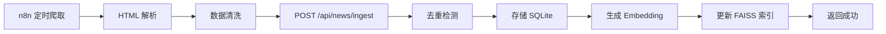
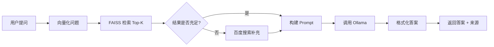

# XU-News-AI-RAG 产品需求文档 (PRD)

**版本**: v1.0  
**创建日期**: 2026-6-30  
**负责人**: XU-News-AI-RAG Team

---

## 1. 产品概述

### 1.1 产品定位

XU-News-AI-RAG 是一个基于 RAG（检索增强生成）技术的新闻智能问答系统，通过爬取、存储、向量化新闻内容，并结合本地大语言模型（Ollama）实现智能检索与问答。

### 1.2 产品目标

- 实现自动化新闻采集与入库
- 提供基于 RAG 的智能问答能力
- 支持新闻聚类分析与热点发现
- 提供可视化的新闻检索与分析界面

### 1.3 核心价值

- **高效检索**: 基于向量检索的语义搜索，相比传统关键词搜索更智能
- **智能问答**: 结合 LLM 的上下文理解能力，提供准确的答案
- **趋势分析**: 自动聚类分析，发现新闻热点和趋势
- **合规安全**: 遵循爬虫规范，保护用户隐私

---

## 2. 用户画像与场景

### 2.1 目标用户

- **新闻分析师**: 需要快速了解特定主题的新闻动态
- **研究人员**: 需要检索历史新闻数据进行分析
- **内容创作者**: 需要获取热点话题和趋势
- **普通用户**: 希望通过自然语言提问获取新闻信息

### 2.2 用户故事

#### US-001: 用户注册与登录

**作为** 新用户  
**我想要** 注册账号并登录系统  
**以便** 使用新闻检索和问答功能

**验收标准**:

- ✅ 支持邮箱 + 密码注册
- ✅ 密码强度验证（至少 8 位，包含字母和数字）
- ✅ 邮箱格式验证
- ✅ 支持 JWT Token 认证
- ✅ Token 有效期 24 小时
- ✅ 登录失败 5 次后锁定账户 15 分钟

#### US-002: 新闻自动采集

**作为** 系统管理员  
**我想要** 通过 n8n 工作流自动爬取新闻  
**以便** 持续更新新闻数据库

**验收标准**:

- ✅ 支持配置新闻源 URL
- ✅ 自动提取标题、正文、发布时间、来源等字段
- ✅ 遵循 robots.txt 规则
- ✅ 支持定时任务（如每小时执行一次）
- ✅ 去重检测（基于 URL 或内容哈希）
- ✅ 异常处理与重试机制

#### US-003: 新闻入库与向量化

**作为** 系统  
**我想要** 将爬取的新闻存储到 SQLite 并生成向量索引  
**以便** 支持后续的语义检索

**验收标准**:

- ✅ 新闻元数据存储到 SQLite
- ✅ 使用 Embedding 模型生成新闻向量
- ✅ 向量存储到 FAISS 索引
- ✅ 保持 SQLite ID 与 FAISS 索引 ID 一致性
- ✅ 支持批量入库（100 条/批次）
- ✅ 记录入库时间与状态

#### US-004: 智能问答（RAG）

**作为** 普通用户  
**我想要** 通过自然语言提问  
**以便** 获取基于新闻内容的准确答案

**验收标准**:

- ✅ 用户输入问题（如"最近关于 AI 的新闻有哪些？"）
- ✅ 系统对问题进行向量化
- ✅ 在 FAISS 中检索 Top-K 相关新闻（K=5）
- ✅ 将检索结果作为上下文传递给 Ollama
- ✅ LLM 生成结构化答案（包含来源引用）
- ✅ 返回答案 + 相关新闻列表（标题、摘要、链接）

#### US-005: 回退搜索机制

**作为** 用户  
**我想要** 当 RAG 检索结果不足时，系统能自动使用百度搜索补充  
**以便** 始终能获取有用的信息

**验收标准**:

- ✅ 当 FAISS 检索得分 < 0.6 或结果数 < 3 时触发
- ✅ 调用百度搜索 API
- ✅ 合并本地检索与网络搜索结果
- ✅ 标注结果来源（本地/网络）
- ✅ 记录回退事件到日志

#### US-006: 新闻聚类分析

**作为** 分析师  
**我想要** 查看新闻的主题聚类结果  
**以便** 发现热点话题和趋势

**验收标准**:

- ✅ 支持对指定时间范围的新闻进行聚类（如近 7 天）
- ✅ 使用 K-Means 或 DBSCAN 算法
- ✅ 自动确定最佳聚类数（3-10 个）
- ✅ 为每个聚类生成主题标签（基于高频词或 LLM 总结）
- ✅ 可视化展示聚类结果（散点图 + 词云）
- ✅ 导出聚类报告（Markdown/PDF）

#### US-007: 关键词统计 Top10

**作为** 用户  
**我想要** 查看特定时间段的热门关键词  
**以便** 了解当前舆论焦点

**验收标准**:

- ✅ 支持按日/周/月维度统计
- ✅ 提取新闻标题与正文的关键词（TF-IDF 或 TextRank）
- ✅ 返回 Top10 关键词及出现频次
- ✅ 支持排除停用词
- ✅ 支持导出为 CSV/JSON

#### US-008: 检索历史记录

**作为** 用户  
**我想要** 查看我的历史提问记录  
**以便** 快速回顾之前的查询结果

**验收标准**:

- ✅ 记录用户每次提问的问题、答案、时间戳
- ✅ 支持分页查询历史记录
- ✅ 支持删除历史记录
- ✅ 历史记录与用户账号绑定

---

## 3. 功能需求

### 3.1 核心功能模块

#### 3.1.1 用户认证模块

- 用户注册（邮箱 + 密码）
- 用户登录（JWT Token）
- Token 刷新
- 密码重置（邮件验证码）
- 账户锁定机制

#### 3.1.2 新闻采集模块 (n8n)

- 配置新闻源
- HTTP 请求 + HTML 解析
- 数据清洗与标准化
- API 回调通知后端入库
- 定时任务调度
- 错误监控与告警

#### 3.1.3 新闻入库模块

- 接收 n8n 回调数据
- 去重检测（URL/Hash）
- 存储到 SQLite
- 调用 Embedding 模型生成向量
- 更新 FAISS 索引
- 返回入库结果

#### 3.1.4 RAG 检索问答模块

- 接收用户问题
- 问题向量化
- FAISS 相似度检索（Top-K）
- 构建 LLM Prompt（问题 + 上下文）
- 调用 Ollama API 生成答案
- 格式化返回结果
- 记录问答历史

#### 3.1.5 回退搜索模块

- 检测 RAG 检索质量
- 调用百度搜索 API
- 结果去重与合并
- 来源标注

#### 3.1.6 聚类分析模块

- 时间范围筛选
- 向量降维（PCA/t-SNE）
- 聚类算法（K-Means/DBSCAN）
- 主题标签生成
- 可视化图表生成
- 报告导出

#### 3.1.7 关键词统计模块

- 文本预处理（分词、去停用词）
- 关键词提取（TF-IDF/TextRank）
- 频次统计与排序
- 时间维度聚合
- 数据导出

#### 3.1.8 数据管理模块

- 新闻列表查询（分页、筛选、排序）
- 新闻详情查看
- 新闻删除（软删除）
- 数据库备份与恢复

---

## 4. 非功能需求

### 4.1 性能要求

- **响应时间**:
  - RAG 问答 < 5 秒（包含 LLM 推理）
  - 关键词检索 < 1 秒
  - 聚类分析 < 30 秒（1000 条新闻）
- **并发**: 支持 50 并发用户
- **吞吐量**: 新闻入库 1000 条/分钟

### 4.2 可用性

- 系统可用性 > 99%（单机部署）
- 异常情况自动降级（如 Ollama 不可用时返回纯检索结果）

### 4.3 可扩展性

- 支持增量更新 FAISS 索引
- 支持水平扩展（多进程/多机器）
- 支持切换不同的 Embedding 模型

### 4.4 安全性

- 所有 API 需要 JWT 认证（除注册/登录）
- 密码使用 bcrypt 加密
- SQL 注入防护
- XSS/CSRF 防护
- 敏感字段脱敏（如手机号、邮箱）

### 4.5 可维护性

- 日志记录（INFO/ERROR/DEBUG）
- 错误追踪（堆栈信息）
- 健康检查接口 `/health`
- 监控指标（Prometheus 兼容）

---

## 5. 技术栈

### 5.1 前端

- React 18 + Vite
- TypeScript
- TailwindCSS
- Axios
- Zustand

### 5.2 后端

- Python 3.11+
- Flask 3.x
- LangChain
- FAISS
- SQLite
- JWT
- Celery

### 5.3 AI 组件

- Ollama（本地 LLM）
- Embedding 模型（如 `mxbai-embed-large`）
- LLM 模型（如 `qwen2.5` 或 `llama3.1`）

### 5.4 工作流

- n8n

### 5.5 基础设施

- Docker
- docker-compose
- Nginx

---

## 6. 数据流程

### 6.1 新闻入库流程

### 6.2 RAG 问答流程

---

## 7. 验收标准总览

### 7.1 功能验收

| 需求编号 | 功能         | 验收标准                         | 优先级 |
| -------- | ------------ | -------------------------------- | ------ |
| REQ-001  | 用户注册登录 | 支持邮箱注册、JWT 认证、密码加密 | P0     |
| REQ-002  | 新闻爬取     | n8n 自动爬取、遵循 robots.txt    | P0     |
| REQ-003  | 新闻入库     | SQLite + FAISS 存储、去重        | P0     |
| REQ-004  | RAG 问答     | 检索 + LLM 生成答案              | P0     |
| REQ-005  | 回退搜索     | 检索不足时调用百度搜索           | P1     |
| REQ-006  | 聚类分析     | K-Means 聚类、主题提取           | P1     |
| REQ-007  | 关键词统计   | TF-IDF Top10 统计                | P2     |
| REQ-008  | 历史记录     | 用户问答历史查询                 | P2     |

### 7.2 性能验收

- 单次 RAG 问答耗时 < 5 秒（95 分位）
- 新闻入库速度 > 500 条/分钟
- 系统响应时间 < 200ms（静态资源）

### 7.3 安全验收

- 所有密码使用 bcrypt（cost=12）
- JWT Token 包含过期时间
- API 限流：100 次/分钟/用户
- 爬虫遵循 robots.txt 与 User-Agent 标识

---

## 8. 里程碑与迭代计划

### 阶段 1: MVP（2 周）

- ✅ 基础用户认证
- ✅ 单一新闻源爬取
- ✅ 简单 RAG 问答
- ✅ 前端基础界面

### 阶段 2: 功能完善（2 周）

- ✅ 多新闻源支持
- ✅ 回退搜索机制
- ✅ 历史记录
- ✅ 关键词统计

### 阶段 3: 高级分析（1 周）

- ✅ 新闻聚类
- ✅ 可视化报告
- ✅ 数据导出

### 阶段 4: 优化与部署（1 周）

- ✅ 性能优化
- ✅ Docker 镜像
- ✅ 文档完善

---

## 9. 风险与依赖

### 9.1 技术风险

- **Ollama 性能**: 本地推理速度受硬件限制（缓解：使用量化模型）
- **FAISS 内存**: 大规模数据可能导致内存溢出（缓解：定期归档旧数据）
- **爬虫反爬**: 目标网站可能封禁 IP（缓解：代理池 + 速率限制）

### 9.2 外部依赖

- Ollama 服务稳定性
- 百度搜索 API 配额
- n8n 服务可用性

---

## 10. 附录

### 10.1 术语表

- **RAG**: Retrieval-Augmented Generation，检索增强生成
- **Embedding**: 向量表示，将文本转为高维向量
- **FAISS**: Facebook AI Similarity Search，高效向量检索库
- **LLM**: Large Language Model，大语言模型
- **n8n**: 开源工作流自动化工具

### 10.2 参考资料

- LangChain 官方文档: https://python.langchain.com/
- FAISS 官方文档: https://faiss.ai/
- Ollama 官方文档: https://ollama.ai/

---

**文档状态**: ✅ 已评审  
**最后更新**: 2026-6-30
