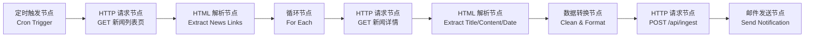
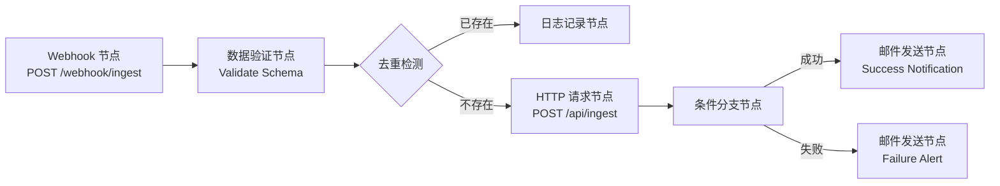
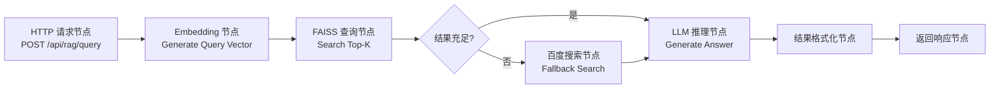
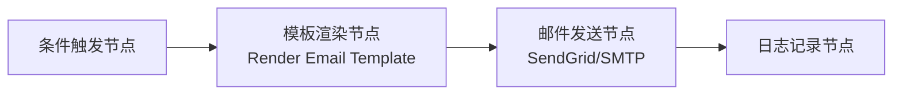
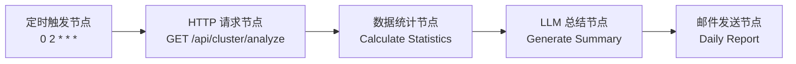
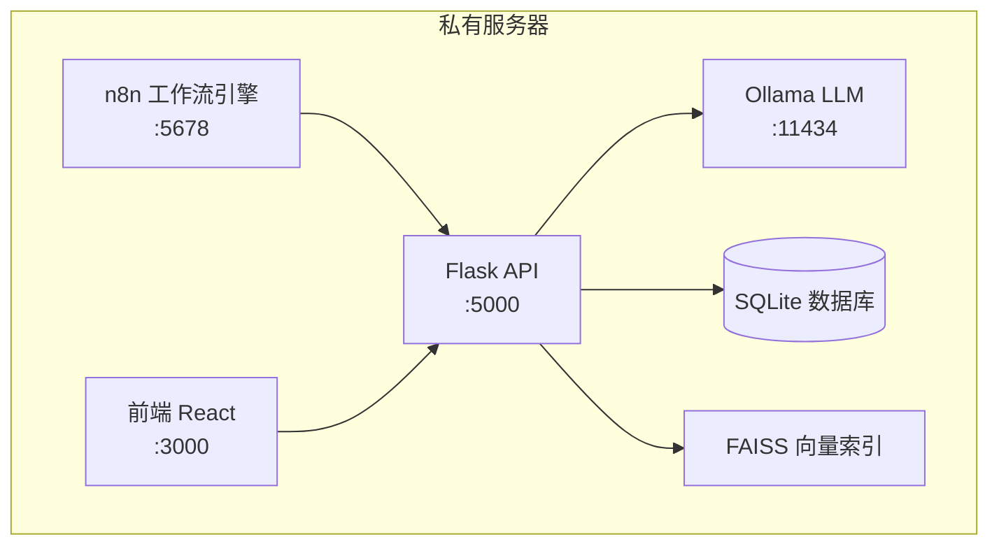

# XU-News-AI-RAG 产品需求文档（考核版）

**版本**: v1.0  
**创建日期**: 2026-07-11  
**负责人**: XU-News-AI-RAG Team  
**考核依据**: 《行前实战营培训考核项目》

---

## 1. 引言背景、目标用户、产品愿景

### 1.1 引言背景

随着互联网信息爆炸式增长，新闻资讯呈现碎片化、分散化特点，用户面临"信息过载"与"获取低效"的双重困境。传统关键词搜索难以满足用户对语义理解、关联分析的深层需求。

本项目旨在构建一个基于 RAG（检索增强生成）技术的**个性化新闻智能知识库**，通过低代码工作流工具 n8n 实现自动化数据采集与处理，结合本地部署的大语言模型 Ollama，为用户提供高效、精准、安全的新闻检索与问答服务。

### 1.2 目标用户

| 用户角色       | 描述                                    | 核心需求                       |
| -------------- | --------------------------------------- | ------------------------------ |
| **新闻分析师** | 需要快速了解特定主题新闻动态的专业人员  | 深度检索、趋势分析、报告生成   |
| **研究人员**   | 需要检索历史新闻数据进行分析的学者/学生 | 精准检索、数据导出、聚类分析   |
| **内容创作者** | 需要获取热点话题和趋势的自媒体/编辑     | 热点发现、关键词统计、素材收集 |
| **普通用户**   | 希望通过自然语言提问获取新闻信息的个人  | 智能问答、个性化推荐、易用界面 |
| **系统管理员** | 负责系统运维和数据管理的技术人员        | 数据入库、任务监控、系统配置   |

### 1.3 产品愿景

- **高效检索**: 基于向量检索的语义搜索，相比传统关键词搜索更智能、更精准
- **智能问答**: 结合 LLM 的上下文理解能力，提供准确、可溯源的答案
- **趋势洞察**: 自动聚类分析，发现新闻热点和趋势
- **合规安全**: 私有化部署，所有数据本地处理，满足数据隐私合规要求
- **低代码编排**: 通过 n8n 实现全流程自动化，降低运维成本

---

## 2. 用户故事与场景描述

### US-001: 用户注册与登录

**作为** 新用户  
**我想要** 通过邮箱和密码注册账号并登录系统  
**以便** 使用新闻检索和问答功能

**场景**:

1. 用户访问注册页面，输入邮箱和密码
2. 系统验证邮箱格式和密码强度（至少8位，包含字母和数字）
3. 验证通过后创建用户账户
4. 用户使用注册凭证登录，系统签发 JWT Token
5. Token 有效期为 24 小时

---

### US-002: 新闻自动采集

**作为** 系统管理员  
**我想要** 通过 n8n 工作流定时自动爬取新闻  
**以便** 持续更新新闻数据库

**场景**:

1. 管理员在 n8n 配置新闻源 RSS 地址或网页 URL
2. 配置定时触发节点（如每小时执行一次）
3. n8n 自动发起 HTTP 请求获取新闻页面
4. 解析 HTML 提取标题、正文、发布时间、来源等字段
5. 遵循 robots.txt 规则，设置合理请求间隔
6. 通过 HTTP 节点将数据发送到后端入库接口

---

### US-003: 新闻入库与向量化

**作为** 系统  
**我想要** 将爬取的新闻自动存储到数据库并生成向量索引  
**以便** 支持后续的语义检索

**场景**:

1. n8n 调用后端 `/api/ingest` 接口提交新闻数据
2. 后端进行去重检测（基于 URL 或内容哈希）
3. 将新闻元数据存储到 SQLite 数据库
4. 调用 Embedding 模型生成新闻内容向量
5. 将向量存储到 FAISS 索引
6. 返回入库结果给 n8n

---

### US-004: 入库成功邮件通知

**作为** 系统管理员  
**我想要** 在新闻入库成功后自动收到邮件通知  
**以便** 及时了解数据采集状态

**场景**:

1. 后端返回入库成功响应给 n8n
2. n8n 邮件节点发送通知邮件到管理员邮箱
3. 邮件包含入库数量、时间、来源等信息
4. 支持自定义邮件模板和触发条件

---

### US-005: 知识库内容管理

**作为** 登录用户  
**我想要** 查看新闻列表、筛选、编辑和删除新闻  
**以便** 管理知识库内容

**场景**:

1. 用户登录后进入新闻管理页面
2. 支持按类型、时间筛选新闻列表
3. 支持单条或批量删除新闻
4. 支持编辑新闻元数据（标签、来源等）
5. 支持页面上传多种类型数据（JSON/Excel）

---

### US-006: 智能问答（RAG）

**作为** 普通用户  
**我想要** 通过自然语言提问获取基于新闻内容的准确答案  
**以便** 快速获取所需信息

**场景**:

1. 用户在问答页面输入问题（如"最近关于人工智能的新闻有哪些？"）
2. 系统对问题进行向量化
3. 在 FAISS 中检索 Top-K 相关新闻
4. 将检索结果作为上下文传递给 Ollama
5. LLM 生成结构化答案（包含来源引用）
6. 返回答案和相关新闻列表

---

### US-007: 回退搜索机制

**作为** 用户  
**我想要** 当知识库无匹配内容时，系统自动联网搜索补充  
**以便** 始终能获取有用的信息

**场景**:

1. 用户提问后，系统在本地 FAISS 中检索
2. 当检索结果不足（相似度 < 0.6 或结果数 < 3）时触发回退
3. 调用百度搜索 API 获取前 3 条结果
4. 合并本地检索与网络搜索结果
5. 标注结果来源（本地/网络）
6. LLM 综合处理后输出回答

---

### US-008: 聚类分析报告

**作为** 分析师  
**我想要** 查看新闻聚类分析结果和关键词 Top10 分布  
**以便** 发现热点话题和趋势

**场景**:

1. 用户进入报告页面，选择时间范围和分类
2. 系统执行 K-Means 聚类分析
3. 生成主题标签和关键词统计
4. 可视化展示聚类结果和关键词分布
5. 支持导出报告（Markdown/PDF）

---

## 3. 产品范围与功能列表

### 3.1 产品范围

| 范围         | 描述                                                 |
| ------------ | ---------------------------------------------------- |
| **用户端**   | 注册/登录、新闻检索、智能问答、内容管理、报告查看    |
| **管理端**   | 数据入库、任务监控、系统配置、用户管理               |
| **自动化层** | n8n 工作流编排、定时任务、数据采集、邮件通知         |
| **AI层**     | Ollama LLM、Embedding 模型、FAISS 向量检索、聚类算法 |
| **数据层**   | SQLite 元数据存储、FAISS 向量索引                    |

### 3.2 功能列表

| 模块         | 功能点       | 描述                          |
| ------------ | ------------ | ----------------------------- |
| **用户认证** | 注册         | 邮箱+密码注册，密码强度验证   |
|              | 登录         | JWT Token 认证                |
|              | Token 刷新   | 支持 Token 过期前刷新         |
|              | 账户锁定     | 登录失败 5 次后锁定 15 分钟   |
| **新闻采集** | RSS 订阅     | 支持 RSS 源配置和解析         |
|              | 网页抓取     | 通过 n8n HTTP + HTML 解析节点 |
|              | 定时任务     | n8n 定时触发（每小时）        |
|              | 数据清洗     | 去除 HTML 标签、标准化格式    |
| **新闻入库** | 批量入库     | 支持 JSON/Excel 导入          |
|              | 去重检测     | URL 去重、内容哈希去重        |
|              | 向量化       | Embedding 模型生成向量        |
|              | 索引更新     | FAISS 向量索引更新            |
| **邮件通知** | 入库通知     | 入库成功后发送邮件            |
|              | 异常告警     | 采集失败时发送告警            |
|              | 自定义模板   | 支持邮件模板配置              |
| **内容管理** | 新闻列表     | 分页查询、筛选、排序          |
|              | 单条编辑     | 编辑标签、来源等元数据        |
|              | 批量删除     | 支持批量删除操作              |
|              | 数据上传     | 页面上传 JSON/Excel           |
| **智能问答** | 语义检索     | FAISS 相似度检索 Top-K        |
|              | LLM 推理     | Ollama 生成答案               |
|              | 来源引用     | 返回相关新闻来源              |
|              | 历史记录     | 保存用户问答历史              |
| **回退搜索** | 质量检测     | 判断检索结果质量              |
|              | 百度搜索     | 调用百度 API 补充             |
|              | 结果合并     | 本地+网络结果合并             |
|              | 来源标注     | 标注本地/网络来源             |
| **聚类分析** | K-Means 聚类 | 自动聚类新闻主题              |
|              | 关键词提取   | TF-IDF/TextRank 提取          |
|              | 可视化展示   | 散点图、词云、柱状图          |
|              | 报告导出     | Markdown/PDF 导出             |

---

## 4. AI 产品特定需求

### 4.1 模型需求

#### 4.1.1 LLM 模型

| 项目           | 要求                                      |
| -------------- | ----------------------------------------- |
| **模型选择**   | 推荐使用 `qwen2.5:3b`（中文优化、轻量级） |
| **备选模型**   | `qwen3.5:0.8b`（更小但性能稍弱）          |
| **推理延迟**   | 单条问答 < 5 秒（包含检索+推理）          |
| **上下文长度** | >= 32K（支持长文档问答）                  |
| **输出格式**   | 支持结构化输出（JSON、列表）              |

#### 4.1.2 Embedding 模型

| 项目           | 要求                                              |
| -------------- | ------------------------------------------------- |
| **模型选择**   | 推荐使用 `sentence-transformers/all-MiniLM-L6-v2` |
| **备选模型**   | `mxbai-embed-large`（更高质量，1024维）           |
| **向量维度**   | 384 维（all-MiniLM-L6-v2）                        |
| **批处理能力** | 支持批量向量化（>= 32 条/批次）                   |
| **语义相似度** | 同主题新闻相似度 > 0.7                            |

#### 4.1.3 Reranker 模型

| 项目         | 要求                                            |
| ------------ | ----------------------------------------------- |
| **模型选择** | 推荐使用 `cross-encoder/ms-marco-MiniLM-L-6-v2` |
| **作用**     | 对检索结果进行重排序，提升相关性                |
| **重排数量** | Top-10 候选进行重排                             |
| **输出结果** | 返回重排后 Top-5                                |

### 4.2 数据需求

#### 4.2.1 数据来源

| 来源类型     | 描述                   | 示例                   |
| ------------ | ---------------------- | ---------------------- |
| **RSS 订阅** | 通过 RSS Feed 获取新闻 | 科技日报、网易新闻 RSS |
| **网页抓取** | 通过 n8n HTTP 节点抓取 | 新闻网站详情页         |
| **手动导入** | 用户上传 JSON/Excel    | 历史新闻数据           |
| **百度搜索** | 回退搜索时调用         | 百度搜索 API           |

#### 4.2.2 数据数量

| 指标           | 要求                          |
| -------------- | ----------------------------- |
| **初始数据量** | >= 1000 条新闻                |
| **每日增量**   | >= 50 条（通过 n8n 自动采集） |
| **支持上限**   | >= 100,000 条新闻             |

#### 4.2.3 数据质量

| 指标           | 要求                      |
| -------------- | ------------------------- |
| **标题完整性** | 1-500 字符，无空标题      |
| **正文长度**   | >= 100 字符，无纯空白内容 |
| **URL 唯一性** | 无重复 URL                |
| **发布时间**   | 格式正确（ISO 8601）      |
| **去重率**     | 重复内容检测率 >= 99%     |

#### 4.2.4 数据标注

| 标注类型     | 描述                             |
| ------------ | -------------------------------- |
| **分类标注** | 新闻分类（科技、财经、娱乐等）   |
| **标签标注** | 关键词标签（AI、GPT、OpenAI 等） |
| **来源标注** | 新闻来源（科技日报、新华网等）   |
| **时间标注** | 发布时间、采集时间               |

### 4.3 算法边界与可解释性

#### 4.3.1 算法边界

| 边界类型     | 说明                                     |
| ------------ | ---------------------------------------- |
| **检索范围** | 仅检索本地知识库已有内容                 |
| **回答范围** | 基于检索到的新闻内容生成答案，不编造事实 |
| **语言范围** | 主要支持中文，支持少量英文新闻           |
| **时效性**   | 回答基于入库的新闻数据，不实时更新       |

#### 4.3.2 可解释性

| 要求           | 说明                               |
| -------------- | ---------------------------------- |
| **来源追溯**   | 每个答案必须包含来源新闻列表和引用 |
| **相似度展示** | 显示每条来源新闻的相似度得分       |
| **推理过程**   | 可选显示 LLM 推理步骤（思维链）    |
| **置信度标注** | 标注回答的置信度等级               |

### 4.4 评估标准

#### 4.4.1 检索质量评估

| 指标                   | 计算公式                            | 目标值  |
| ---------------------- | ----------------------------------- | ------- |
| **精确率 (Precision)** | 相关结果数 / 总返回结果数           | >= 80%  |
| **召回率 (Recall)**    | 检索到的相关结果数 / 所有相关结果数 | >= 70%  |
| **平均相似度**         | 所有返回结果相似度的平均值          | >= 0.65 |

#### 4.4.2 回答质量评估

| 指标         | 评估方法                 | 目标值 |
| ------------ | ------------------------ | ------ |
| **准确率**   | 人工评估答案正确性       | >= 85% |
| **相关性**   | 答案与问题的相关程度     | >= 90% |
| **完整性**   | 答案是否覆盖问题关键点   | >= 80% |
| **可溯源性** | 答案是否可追溯到来源新闻 | 100%   |

#### 4.4.3 性能评估

| 指标             | 目标值             |
| ---------------- | ------------------ |
| **RAG 问答延迟** | < 5 秒（P95）      |
| **检索延迟**     | < 500ms            |
| **向量化速度**   | > 100 条/分钟      |
| **聚类分析延迟** | < 30 秒（1000 条） |

### 4.5 伦理与合规

#### 4.5.1 数据隐私

| 要求             | 说明                               |
| ---------------- | ---------------------------------- |
| **本地部署**     | 所有数据存储在本地，不上传第三方云 |
| **数据加密**     | 密码使用 bcrypt 加密（cost=12）    |
| **敏感数据脱敏** | 用户邮箱、密码等敏感信息脱敏存储   |
| **访问控制**     | 基于角色的访问控制（RBAC）         |

#### 4.5.2 爬虫合规

| 要求                | 说明                          |
| ------------------- | ----------------------------- |
| **robots.txt 遵守** | 爬取前检查目标网站 robots.txt |
| **User-Agent 标识** | 设置合理的 User-Agent         |
| **请求速率限制**    | 设置合理请求间隔（>= 1 秒）   |
| **版权声明**        | 新闻内容仅用于个人学习和研究  |

#### 4.5.3 内容合规

| 要求             | 说明                             |
| ---------------- | -------------------------------- |
| **内容审核**     | 自动过滤违法违规内容             |
| **虚假信息识别** | 标注信息来源，不保证绝对真实     |
| **免责声明**     | 明确说明 AI 生成内容可能存在偏差 |

---

## 5. 非功能性需求

### 5.1 性能要求

| 指标           | 目标值                           |
| -------------- | -------------------------------- |
| **响应时间**   | RAG 问答 < 5 秒（包含 LLM 推理） |
|                | 关键词检索 < 1 秒                |
|                | 聚类分析 < 30 秒（1000 条新闻）  |
| **并发支持**   | 支持 50 并发用户                 |
| **吞吐量**     | 新闻入库 1000 条/分钟            |
| **FAISS 检索** | 10 万条数据检索 < 100ms          |

### 5.2 可用性

| 指标             | 目标值                        |
| ---------------- | ----------------------------- |
| **系统可用性**   | > 99%（单机部署）             |
| **故障恢复时间** | < 5 分钟（重启恢复）          |
| **降级策略**     | Ollama 不可用时返回纯检索结果 |
| **健康检查**     | 提供 `/health` 接口实时监控   |

### 5.3 可扩展性

| 要求             | 说明                              |
| ---------------- | --------------------------------- |
| **向量索引扩展** | 支持增量更新 FAISS 索引           |
| **模型切换**     | 支持切换不同的 Embedding/LLM 模型 |
| **新闻源扩展**   | 支持动态添加新闻源                |
| **水平扩展**     | 支持多进程/多机器部署             |

### 5.4 安全性

| 要求              | 说明                          |
| ----------------- | ----------------------------- |
| **认证机制**      | JWT Token 认证（除注册/登录） |
| **密码加密**      | bcrypt（cost=12）             |
| **SQL 注入防护**  | 参数化查询                    |
| **XSS/CSRF 防护** | 输入转义、CSRF Token          |
| **API 限流**      | 100 请求/分钟/用户            |
| **CORS 白名单**   | 仅允许指定域名访问            |

### 5.5 可维护性

| 要求         | 说明                           |
| ------------ | ------------------------------ |
| **日志记录** | INFO/ERROR/DEBUG 三级日志      |
| **错误追踪** | 记录堆栈信息                   |
| **监控指标** | Prometheus 兼容指标            |
| **配置管理** | 环境变量 + .env 文件           |
| **代码规范** | PEP8（Python）、ESLint（前端） |

---

## 6. n8n 工作流专项需求

### 6.1 工作流场景设计

#### 6.1.1 新闻采集工作流

**触发方式**: 定时触发（每小时）

**节点流程**:



**节点说明**:
| 节点 | 类型 | 配置 |
|------|------|------|
| A | Cron Trigger | 0 \* \* \* \*（每小时） |
| B | HTTP Request | Method: GET, URL: 新闻列表页 |
| C | HTML Extract | Selector: a[href] |
| D | For Each | Array: news_links |
| E | HTTP Request | Method: GET, URL: {{$node['C'].json['url']}} |
| F | HTML Extract | Selector: h1.title, div.content, time.publish |
| G | Set | Clean HTML tags, Format datetime |
| H | HTTP Request | Method: POST, URL: http://localhost:5000/api/ingest |
| I | Email | To: admin@xu-news.com |

#### 6.1.2 新闻入库工作流

**触发方式**: Webhook 触发（接收采集数据）

**节点流程**:



#### 6.1.3 RAG 查询工作流

**触发方式**: API 调用触发

**节点流程**:



#### 6.1.4 邮件通知工作流

**触发方式**: 条件触发（入库成功/失败）

**节点流程**:



**邮件模板**:

```
主题: 【XU-News】新闻入库通知

正文:
尊敬的管理员：

今日新闻入库完成，详情如下：
- 入库数量：{{total_count}} 条
- 成功：{{success_count}} 条
- 失败：{{failed_count}} 条
- 重复跳过：{{duplicate_count}} 条

入库时间：{{ingest_time}}

此致
XU-News 系统
```

#### 6.1.5 聚类分析工作流

**触发方式**: 定时触发（每日凌晨）

**节点流程**:



### 6.2 节点选型与配置要求

#### 6.2.1 核心节点选型

| 节点类型      | 推荐节点              | 用途               |
| ------------- | --------------------- | ------------------ |
| **定时触发**  | Cron Trigger          | 定时执行采集任务   |
| **HTTP 请求** | HTTP Request          | 网页抓取、API 调用 |
| **HTML 解析** | HTML Extract          | 提取新闻内容       |
| **数据验证**  | JSON Schema Validator | 验证数据格式       |
| **数据转换**  | Set / Code            | 数据清洗和转换     |
| **循环处理**  | For Each              | 批量处理新闻列表   |
| **条件分支**  | If/Else               | 处理成功/失败分支  |
| **邮件发送**  | Email                 | 发送通知邮件       |
| **日志记录**  | Logger                | 记录执行日志       |

#### 6.2.2 节点配置要求

| 节点         | 配置项         | 要求                    |
| ------------ | -------------- | ----------------------- |
| HTTP Request | Timeout        | >= 30 秒                |
|              | Retries        | 3 次                    |
|              | Delay          | >= 1 秒（防反爬）       |
| HTML Extract | Selectors      | 根据目标网站配置        |
|              | Error Handling | Continue on fail        |
| Email        | SMTP Server    | 配置企业邮箱或 SendGrid |
|              | From Address   | noreply@xu-news.com     |
|              | Template       | 支持 Handlebars 模板    |
| Cron Trigger | Schedule       | 可配置（默认每小时）    |
|              | Timezone       | Asia/Shanghai           |

### 6.3 工作流触发条件与异常处理机制

#### 6.3.1 触发条件

| 工作流   | 触发方式 | 触发条件      |
| -------- | -------- | ------------- |
| 新闻采集 | 定时触发 | 每小时整点    |
| 新闻入库 | Webhook  | 收到采集数据  |
| RAG 查询 | API 调用 | 用户提问      |
| 邮件通知 | 条件触发 | 入库成功/失败 |
| 聚类分析 | 定时触发 | 每日凌晨 2:00 |

#### 6.3.2 异常处理机制

| 异常类型           | 处理策略                          |
| ------------------ | --------------------------------- |
| **HTTP 请求失败**  | 重试 3 次，间隔递增（1s, 2s, 4s） |
| **HTML 解析失败**  | 跳过当前新闻，记录错误日志        |
| **入库接口失败**   | 保存到队列，稍后重试              |
| **Ollama 不可用**  | 返回纯检索结果，记录告警          |
| **FAISS 查询失败** | 返回空结果，触发回退搜索          |
| **邮件发送失败**   | 重试 2 次，记录错误日志           |

#### 6.3.3 错误日志与告警

| 日志级别 | 内容                                   |
| -------- | -------------------------------------- |
| INFO     | 正常执行日志（入库成功、任务完成）     |
| WARNING  | 警告日志（检索质量不足、回退搜索触发） |
| ERROR    | 错误日志（API 调用失败、数据解析失败） |
| CRITICAL | 严重错误（服务不可用、数据库连接失败） |

**告警机制**:

- ERROR 级别：发送邮件告警
- CRITICAL 级别：发送邮件 + 短信告警（预留）

### 6.4 私有化部署合规要求

#### 6.4.1 部署架构



#### 6.4.2 合规要求

| 要求           | 说明                                       |
| -------------- | ------------------------------------------ |
| **数据本地化** | 所有数据存储在本地服务器，不上传第三方云   |
| **网络隔离**   | 可选部署在内网，仅开放必要端口             |
| **访问控制**   | n8n 配置管理员账户，启用双因素认证（推荐） |
| **审计日志**   | 记录所有工作流执行日志和 API 调用日志      |
| **备份策略**   | 每日自动备份数据库和向量索引               |
| **更新机制**   | 定期更新 n8n 和模型版本，及时修复安全漏洞  |

---

## 7. 发布标准与衡量指标

### 7.1 功能发布标准

| 模块         | 发布标准                                         |
| ------------ | ------------------------------------------------ |
| **用户认证** | 注册、登录、Token 刷新功能正常，密码加密验证通过 |
| **新闻采集** | n8n 定时采集正常，每日增量 >= 50 条              |
| **新闻入库** | 去重率 >= 99%，向量索引更新正常                  |
| **邮件通知** | 入库成功/失败邮件正常发送                        |
| **内容管理** | 列表查询、编辑、删除功能正常                     |
| **智能问答** | RAG 问答延迟 < 5 秒，答案可溯源                  |
| **回退搜索** | 检索不足时自动触发百度搜索                       |
| **聚类分析** | K-Means 聚类正常，关键词 Top10 正确              |

### 7.2 性能衡量指标

| 指标             | 目标值        | 测量方法             |
| ---------------- | ------------- | -------------------- |
| **RAG 问答延迟** | < 5 秒（P95） | 日志统计响应时间     |
| **检索准确率**   | >= 80%        | 人工评估检索结果     |
| **回答准确率**   | >= 85%        | 人工评估回答质量     |
| **系统可用性**   | > 99%         | 健康检查接口监控     |
| **API 错误率**   | < 1%          | 日志统计错误请求比例 |

### 7.3 用户体验衡量指标

| 指标             | 目标值               |
| ---------------- | -------------------- |
| **页面加载时间** | < 2 秒（首页）       |
| **登录成功率**   | > 99%                |
| **问答完成率**   | > 95%                |
| **用户满意度**   | >= 4.5/5（问卷调查） |

---

## 8. 待定项与未来规划

### 8.1 待定项

| 编号     | 项目              | 状态 | 备注                 |
| -------- | ----------------- | ---- | -------------------- |
| TODO-001 | 百度搜索 API 配置 | 待定 | 需要申请百度 API Key |
| TODO-002 | 邮件服务配置      | 待定 | 需要配置 SMTP 服务器 |
| TODO-003 | n8n 双因素认证    | 待定 | 增强安全性           |
| TODO-004 | Redis 缓存集成    | 待定 | 提升性能             |
| TODO-005 | PostgreSQL 迁移   | 待定 | 支持更大规模数据     |

### 8.2 短期规划（1-3 个月）

| 项目             | 描述                           |
| ---------------- | ------------------------------ |
| **多新闻源支持** | 扩展支持更多 RSS 源和新闻网站  |
| **移动端适配**   | 前端响应式设计，支持移动端访问 |
| **实时推送**     | WebSocket 推送最新新闻         |
| **用户个性化**   | 基于用户历史记录推荐新闻       |

### 8.3 中期规划（3-6 个月）

| 项目             | 描述                         |
| ---------------- | ---------------------------- |
| **多模态支持**   | 支持图片新闻和视频新闻       |
| **分布式爬虫**   | 扩展爬虫能力，支持更多数据源 |
| **API 开放平台** | 开放 API 供第三方应用集成    |
| **数据分析大屏** | 实时数据可视化大屏           |

### 8.4 长期规划（6-12 个月）

| 项目                | 描述                               |
| ------------------- | ---------------------------------- |
| **微服务化改造**    | 将单体应用拆分为微服务             |
| **Kubernetes 部署** | 容器化部署，支持弹性伸缩           |
| **多租户支持**      | 支持多个组织/团队使用              |
| **数据湖集成**      | 与大数据平台集成，支持更复杂的分析 |

---

**文档状态**: ✅ 待评审  
**最后更新**: 2026-07-11
