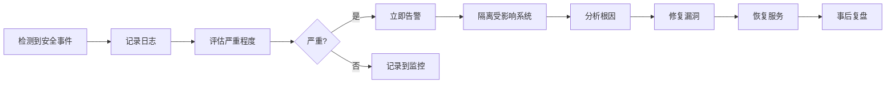

# XU-News-AI-RAG 安全与合规文档

**版本**: v1.0  
**创建日期**: 2026-6-30  
**安全负责人**: XU-News-AI-RAG Security Team

---

## 1. 安全概述

### 1.1 安全目标

- 保护用户数据隐私与安全
- 确保系统免受常见 Web 攻击
- 遵循网络爬虫最佳实践与法律法规
- 建立完善的安全监控与应急响应机制

### 1.2 合规要求

- **数据保护**: 遵循 GDPR / 中国《个人信息保护法》
- **爬虫合规**: 遵守 robots.txt 协议与网站服务条款
- **内容安全**: 过滤敏感信息，防止违法内容传播

---

## 2. 爬虫合规设计

### 2.1 robots.txt 遵循

**实现机制**:

```python
# backend/app/utils/crawler_compliance.py
import requests
from urllib.robotparser import RobotFileParser

class RobotsTxtChecker:
    """robots.txt 检查器"""

    def __init__(self):
        self.parsers = {}  # 缓存 robots.txt 解析器

    def can_fetch(self, url: str, user_agent: str = "XU-News-Bot/1.0") -> bool:
        """检查是否允许爬取"""
        from urllib.parse import urlparse

        parsed = urlparse(url)
        base_url = f"{parsed.scheme}://{parsed.netloc}"
        robots_url = f"{base_url}/robots.txt"

        # 获取或缓存 robots.txt 解析器
        if base_url not in self.parsers:
            parser = RobotFileParser()
            parser.set_url(robots_url)
            try:
                parser.read()
                self.parsers[base_url] = parser
            except Exception as e:
                # robots.txt 不存在或无法访问，默认允许
                return True

        parser = self.parsers[base_url]
        return parser.can_fetch(user_agent, url)

# 使用示例
checker = RobotsTxtChecker()
if checker.can_fetch(target_url):
    # 允许爬取
    crawl(target_url)
else:
    # 禁止爬取
    logger.warning(f"Blocked by robots.txt: {target_url}")
```

**n8n 工作流集成**:

```javascript
// n8n HTTP Request 节点前置检查
const robotsChecker = await fetch(
  "http://backend:5000/api/v1/crawler/check-robots",
  {
    method: "POST",
    body: JSON.stringify({ url: $node["获取新闻列表"].json.url }),
  },
);

const allowed = robotsChecker.json().allowed;

if (!allowed) {
  // 跳过该 URL
  return null;
}
```

---

### 2.2 速率限制（Rate Limiting）

**目标**: 避免对目标网站造成过大负载

**实现策略**:

#### 2.2.1 全局速率限制

```python
from flask_limiter import Limiter
from flask_limiter.util import get_remote_address

limiter = Limiter(
    app=app,
    key_func=get_remote_address,
    default_limits=["100 per minute"]
)

@app.route('/api/v1/news')
@limiter.limit("20 per minute")  # 特定接口限制
def get_news():
    ...
```

#### 2.2.2 爬虫速率控制

**n8n 工作流配置**:

```json
{
  "nodes": [
    {
      "type": "n8n-nodes-base.httpRequest",
      "parameters": {
        "url": "={{$node[\"新闻列表\"].json.url}}",
        "options": {
          "timeout": 10000,
          "retry": {
            "maxRetries": 3,
            "retryDelay": 2000
          }
        }
      }
    },
    {
      "type": "n8n-nodes-base.wait",
      "parameters": {
        "amount": 2,
        "unit": "seconds"
      },
      "notes": "每次请求间隔 2 秒"
    }
  ]
}
```

**后端限流器**:

```python
import time
from collections import defaultdict

class CrawlerRateLimiter:
    """爬虫速率限制器"""

    def __init__(self):
        self.last_request_time = defaultdict(float)
        self.min_interval = 2.0  # 每个域名最小间隔 2 秒

    def wait_if_needed(self, domain: str):
        """等待到允许时间"""
        last_time = self.last_request_time[domain]
        elapsed = time.time() - last_time

        if elapsed < self.min_interval:
            sleep_time = self.min_interval - elapsed
            time.sleep(sleep_time)

        self.last_request_time[domain] = time.time()
```

---

### 2.3 User-Agent 标识

**规范**: 明确标识爬虫身份，提供联系方式

**配置**:

```python
USER_AGENT = "XU-News-Bot/1.0 (+https://xu-news.com/bot; contact@xu-news.com)"

# 在 n8n HTTP Request 中配置
headers = {
    'User-Agent': USER_AGENT
}
```

**示例**:

```
User-Agent: XU-News-Bot/1.0 (+https://xu-news.com/bot; contact@xu-news.com)
```

---

### 2.4 敏感信息过滤

**敏感字段处理**:

```python
import re

class SensitiveInfoFilter:
    """敏感信息过滤器"""

    def __init__(self):
        # 正则表达式
        self.phone_pattern = re.compile(r'1[3-9]\d{9}')
        self.email_pattern = re.compile(r'\b[A-Za-z0-9._%+-]+@[A-Za-z0-9.-]+\.[A-Z|a-z]{2,}\b')
        self.idcard_pattern = re.compile(r'\d{17}[\dXx]')

    def mask_phone(self, text: str) -> str:
        """手机号脱敏: 138****5678"""
        return self.phone_pattern.sub(lambda m: m.group()[:3] + '****' + m.group()[-4:], text)

    def mask_email(self, text: str) -> str:
        """邮箱脱敏: u***@example.com"""
        def replace(match):
            email = match.group()
            local, domain = email.split('@')
            return f"{local[0]}***@{domain}"
        return self.email_pattern.sub(replace, text)

    def remove_idcard(self, text: str) -> str:
        """移除身份证号"""
        return self.idcard_pattern.sub('[已隐藏]', text)

    def filter(self, text: str) -> str:
        """综合过滤"""
        text = self.mask_phone(text)
        text = self.mask_email(text)
        text = self.remove_idcard(text)
        return text

# 在新闻入库时应用
filter = SensitiveInfoFilter()
news.content = filter.filter(news.content)
```

---

### 2.5 爬虫日志记录

**日志内容**:

- 爬取时间
- 目标 URL
- 爬取结果（成功/失败）
- 错误信息（如被封禁）
- robots.txt 检查结果

**日志示例**:

```python
import logging

crawler_logger = logging.getLogger('crawler')
crawler_logger.setLevel(logging.INFO)

# 文件处理器
handler = logging.FileHandler('logs/crawler.log')
formatter = logging.Formatter(
    '%(asctime)s - %(name)s - %(levelname)s - %(message)s'
)
handler.setFormatter(formatter)
crawler_logger.addHandler(handler)

# 记录爬取
crawler_logger.info(f"Crawling: {url}")
crawler_logger.info(f"Robots.txt allowed: {allowed}")
crawler_logger.info(f"Status: {response.status_code}")
```

**日志归档**:

```bash
# logrotate 配置
/var/log/xu-news/crawler.log {
    daily
    rotate 30
    compress
    delaycompress
    notifempty
    create 0640 www-data www-data
}
```

---

## 3. 认证与鉴权

### 3.1 JWT Token 安全

#### 3.1.1 Token 生成

```python
import jwt
import datetime

SECRET_KEY = os.getenv('JWT_SECRET')  # 从环境变量读取
ALGORITHM = 'HS256'
EXPIRATION_HOURS = 24

def generate_token(user_id: int) -> str:
    """生成 JWT Token"""
    payload = {
        'user_id': user_id,
        'exp': datetime.datetime.utcnow() + datetime.timedelta(hours=EXPIRATION_HOURS),
        'iat': datetime.datetime.utcnow(),
        'jti': str(uuid.uuid4())  # Token 唯一 ID
    }
    token = jwt.encode(payload, SECRET_KEY, algorithm=ALGORITHM)
    return token
```

**安全要点**:

- ✅ 使用强密钥（至少 32 字符，随机生成）
- ✅ 设置合理过期时间（24 小时）
- ✅ 包含签发时间（iat）与唯一 ID（jti）
- ✅ 使用 HS256 算法（生产环境可用 RS256）

#### 3.1.2 Token 验证

```python
from functools import wraps
from flask import request, jsonify

def require_auth(f):
    """认证装饰器"""
    @wraps(f)
    def decorated_function(*args, **kwargs):
        token = None

        # 从 Header 提取 Token
        if 'Authorization' in request.headers:
            auth_header = request.headers['Authorization']
            try:
                token = auth_header.split(' ')[1]  # Bearer <token>
            except IndexError:
                return jsonify({'code': 40001, 'message': 'Invalid token format'}), 401

        if not token:
            return jsonify({'code': 40001, 'message': 'Token missing'}), 401

        try:
            # 验证 Token
            payload = jwt.decode(token, SECRET_KEY, algorithms=[ALGORITHM])
            request.user_id = payload['user_id']
        except jwt.ExpiredSignatureError:
            return jsonify({'code': 40001, 'message': 'Token expired'}), 401
        except jwt.InvalidTokenError:
            return jsonify({'code': 40001, 'message': 'Invalid token'}), 401

        return f(*args, **kwargs)

    return decorated_function

# 使用
@app.route('/api/v1/news')
@require_auth
def get_news():
    user_id = request.user_id
    ...
```

#### 3.1.3 Token 刷新机制

```python
@app.route('/api/v1/auth/refresh', methods=['POST'])
@require_auth
def refresh_token():
    """刷新 Token"""
    user_id = request.user_id

    # 检查旧 Token 是否在黑名单（可选）
    # if is_token_blacklisted(old_token):
    #     return jsonify({'code': 40001, 'message': 'Token revoked'}), 401

    # 生成新 Token
    new_token = generate_token(user_id)

    return jsonify({
        'code': 0,
        'data': {
            'token': new_token,
            'expires_in': EXPIRATION_HOURS * 3600
        }
    })
```

---

### 3.2 密码安全

#### 3.2.1 密码存储

```python
from passlib.hash import bcrypt

class User(db.Model):
    ...

    def set_password(self, password: str):
        """设置密码（bcrypt 加密）"""
        # 验证密码强度
        if not self._validate_password_strength(password):
            raise ValueError("密码强度不足")

        # bcrypt 加密（cost=12）
        self.password_hash = bcrypt.hash(password, rounds=12)

    def check_password(self, password: str) -> bool:
        """验证密码"""
        return bcrypt.verify(password, self.password_hash)

    @staticmethod
    def _validate_password_strength(password: str) -> bool:
        """验证密码强度"""
        if len(password) < 8 or len(password) > 32:
            return False

        # 必须包含字母和数字
        has_letter = any(c.isalpha() for c in password)
        has_digit = any(c.isdigit() for c in password)

        return has_letter and has_digit
```

**密码规则**:

- 长度: 8-32 位
- 必须包含: 字母 + 数字
- 推荐包含: 大小写 + 特殊字符
- 禁止: 连续字符（123456）、常见密码（password）

#### 3.2.2 账户锁定机制

```python
MAX_FAILED_ATTEMPTS = 5
LOCKOUT_DURATION_MINUTES = 15

class User(db.Model):
    ...
    failed_login_attempts = db.Column(db.Integer, default=0)
    is_locked = db.Column(db.Boolean, default=False)
    locked_until = db.Column(db.DateTime, nullable=True)

    def increment_failed_login(self):
        """增加失败次数"""
        self.failed_login_attempts += 1

        if self.failed_login_attempts >= MAX_FAILED_ATTEMPTS:
            self.is_locked = True
            self.locked_until = datetime.datetime.utcnow() + \
                               datetime.timedelta(minutes=LOCKOUT_DURATION_MINUTES)

        db.session.commit()

    def reset_failed_login(self):
        """重置失败次数"""
        self.failed_login_attempts = 0
        self.is_locked = False
        self.locked_until = None
        db.session.commit()

    def is_account_locked(self) -> bool:
        """检查账户是否锁定"""
        if not self.is_locked:
            return False

        # 检查锁定是否已过期
        if self.locked_until and datetime.datetime.utcnow() > self.locked_until:
            self.reset_failed_login()
            return False

        return True
```

---

### 3.3 权限控制（RBAC）

**角色定义**:

- `user`: 普通用户（查询、问答）
- `admin`: 管理员（用户管理、数据管理、系统配置）

```python
def require_role(role: str):
    """角色权限装饰器"""
    def decorator(f):
        @wraps(f)
        def decorated_function(*args, **kwargs):
            user = User.query.get(request.user_id)

            if user.role != role:
                return jsonify({
                    'code': 40003,
                    'message': '权限不足'
                }), 403

            return f(*args, **kwargs)

        return decorated_function
    return decorator

# 使用
@app.route('/api/v1/admin/users')
@require_auth
@require_role('admin')
def manage_users():
    ...
```

---

## 4. 数据安全

### 4.1 数据加密

#### 4.1.1 传输加密

**HTTPS 配置（Nginx）**:

```nginx
server {
    listen 443 ssl http2;
    server_name xu-news.com;

    # SSL 证书
    ssl_certificate /etc/nginx/ssl/xu-news.com.crt;
    ssl_certificate_key /etc/nginx/ssl/xu-news.com.key;

    # SSL 协议
    ssl_protocols TLSv1.2 TLSv1.3;
    ssl_ciphers HIGH:!aNULL:!MD5;
    ssl_prefer_server_ciphers on;

    # HSTS
    add_header Strict-Transport-Security "max-age=31536000; includeSubDomains" always;

    location / {
        proxy_pass http://backend:5000;
    }
}

# HTTP 重定向到 HTTPS
server {
    listen 80;
    server_name xu-news.com;
    return 301 https://$server_name$request_uri;
}
```

#### 4.1.2 数据库加密（可选）

**使用 SQLCipher 加密 SQLite**:

```python
from sqlalchemy import create_engine

# 加密数据库
engine = create_engine(
    'sqlite+pysqlcipher:///xu_news.db?cipher=aes-256-cfb&kdf_iter=64000',
    connect_args={'password': os.getenv('DB_ENCRYPTION_KEY')}
)
```

---

### 4.2 敏感数据脱敏

**日志脱敏**:

```python
import logging

class SensitiveDataFilter(logging.Filter):
    """日志敏感数据过滤器"""

    def filter(self, record):
        # 脱敏邮箱
        record.msg = re.sub(
            r'\b[A-Za-z0-9._%+-]+@[A-Za-z0-9.-]+\.[A-Z|a-z]{2,}\b',
            lambda m: m.group().split('@')[0][0] + '***@' + m.group().split('@')[1],
            str(record.msg)
        )
        return True

logger = logging.getLogger('app')
logger.addFilter(SensitiveDataFilter())
```

**API 响应脱敏**:

```python
def mask_user_data(user_dict):
    """用户数据脱敏"""
    if 'email' in user_dict:
        email = user_dict['email']
        local, domain = email.split('@')
        user_dict['email'] = f"{local[0]}***@{domain}"

    # 移除敏感字段
    user_dict.pop('password_hash', None)

    return user_dict
```

---

## 5. 防护机制

### 5.1 SQL 注入防护

**使用参数化查询**:

```python
# ❌ 不安全（字符串拼接）
keyword = request.args.get('keyword')
query = f"SELECT * FROM news WHERE title LIKE '%{keyword}%'"
db.session.execute(query)

# ✅ 安全（参数化查询）
keyword = request.args.get('keyword')
query = text("SELECT * FROM news WHERE title LIKE :keyword")
db.session.execute(query, {'keyword': f'%{keyword}%'})

# ✅ 推荐（ORM）
keyword = request.args.get('keyword')
News.query.filter(News.title.like(f'%{keyword}%')).all()
```

---

### 5.2 XSS 防护

**输入转义**:

```python
from markupsafe import escape

def sanitize_input(text: str) -> str:
    """转义 HTML 特殊字符"""
    return escape(text)

# 在入库时转义
news.title = sanitize_input(news_data['title'])
```

**Content Security Policy (CSP)**:

```python
@app.after_request
def set_csp(response):
    response.headers['Content-Security-Policy'] = \
        "default-src 'self'; script-src 'self'; style-src 'self' 'unsafe-inline'"
    return response
```

---

### 5.3 CSRF 防护

**Flask-WTF CSRF 保护**:

```python
from flask_wtf.csrf import CSRFProtect

csrf = CSRFProtect(app)

# 前端在表单中包含 CSRF Token
# <input type="hidden" name="csrf_token" value="{{ csrf_token() }}">
```

**API 使用 JWT 认证（无需 CSRF Token）**:

```
由于使用 JWT Token 认证，且 Token 存储在 localStorage（而非 Cookie），
已自然免疫 CSRF 攻击。
```

---

### 5.4 CORS 配置

```python
from flask_cors import CORS

# 生产环境：限制允许的域名
CORS(app, resources={
    r"/api/*": {
        "origins": ["https://xu-news.com"],
        "methods": ["GET", "POST", "PUT", "DELETE"],
        "allow_headers": ["Content-Type", "Authorization"]
    }
})

# 开发环境：允许所有（仅开发）
# CORS(app)
```

---

## 6. 日志与监控

### 6.1 日志策略

**日志级别**:

- DEBUG: 详细调试信息（仅开发环境）
- INFO: 常规操作（用户登录、新闻入库）
- WARNING: 警告（检索质量不足、回退搜索）
- ERROR: 错误（API 调用失败、数据库异常）
- CRITICAL: 严重错误（服务崩溃）

**日志格式**:

```python
logging.basicConfig(
    level=logging.INFO,
    format='%(asctime)s - %(name)s - %(levelname)s - [%(filename)s:%(lineno)d] - %(message)s',
    handlers=[
        logging.FileHandler('logs/app.log'),
        logging.StreamHandler()
    ]
)
```

**日志示例**:

```
2026-6-30 10:30:15,123 - app - INFO - [auth.py:45] - User login: user_id=123
2026-6-30 10:31:20,456 - app - WARNING - [rag_service.py:78] - Low retrieval score (0.52), fallback triggered
2026-6-30 10:32:05,789 - app - ERROR - [news_service.py:102] - Database connection failed: OperationalError
```

---

### 6.2 安全事件监控

**关键事件**:

- 登录失败（连续 5 次）
- 账户锁定
- 非法 API 访问
- SQL 注入尝试
- 速率限制触发

**告警机制**:

```python
import smtplib
from email.mime.text import MIMEText

def send_security_alert(event_type: str, details: dict):
    """发送安全告警邮件"""
    subject = f"[XU-News 安全告警] {event_type}"
    body = f"时间: {datetime.datetime.now()}\n事件: {event_type}\n详情: {details}"

    msg = MIMEText(body)
    msg['Subject'] = subject
    msg['From'] = 'alert@xu-news.com'
    msg['To'] = 'admin@xu-news.com'

    with smtplib.SMTP(os.getenv('SMTP_HOST'), os.getenv('SMTP_PORT')) as server:
        server.login(os.getenv('SMTP_USER'), os.getenv('SMTP_PASSWORD'))
        server.send_message(msg)

# 使用
if user.failed_login_attempts >= 5:
    send_security_alert('账户锁定', {'user_id': user.id, 'email': user.email})
```

---

## 7. 应急响应

### 7.1 安全事件响应流程



### 7.2 常见安全事件处理

**数据泄露**:

1. 立即停止服务
2. 隔离受影响数据库
3. 通知受影响用户
4. 分析泄露范围与原因
5. 修复漏洞
6. 强制用户重置密码

**DDoS 攻击**:

1. 启用 CDN / WAF
2. 限制单 IP 请求频率
3. 封禁恶意 IP
4. 联系 ISP 提供商

**恶意爬虫**:

1. 分析爬虫特征（IP、User-Agent）
2. 更新 robots.txt
3. 封禁恶意 IP 段
4. 增加 CAPTCHA 验证

---

## 8. 合规检查清单

### 8.1 爬虫合规

- [ ] 遵循 robots.txt 协议
- [ ] User-Agent 明确标识身份与联系方式
- [ ] 速率限制（每个域名间隔 >= 2 秒）
- [ ] 记录爬取日志
- [ ] 不爬取需要登录的内容
- [ ] 不爬取版权保护内容
- [ ] 敏感信息过滤（手机号、邮箱、身份证）

### 8.2 数据安全

- [ ] 密码使用 bcrypt 加密（cost >= 12）
- [ ] JWT Token 使用强密钥（>= 32 字符）
- [ ] HTTPS 传输（TLS 1.2+）
- [ ] 敏感日志脱敏
- [ ] 定期数据备份（每日）
- [ ] 数据库访问权限控制

### 8.3 应用安全

- [ ] SQL 注入防护（参数化查询）
- [ ] XSS 防护（输入转义 + CSP）
- [ ] CSRF 防护（JWT 认证）
- [ ] 速率限制（100 次/分钟）
- [ ] 账户锁定机制（5 次失败）
- [ ] 安全日志记录

### 8.4 隐私保护

- [ ] 用户数据最小化收集
- [ ] 提供隐私政策
- [ ] 用户可删除自己的数据
- [ ] 历史记录仅用户本人可见
- [ ] 不向第三方泄露用户数据

---

## 9. 安全配置示例

### 9.1 环境变量（.env）

```bash
# JWT 密钥（生产环境必须修改！）
JWT_SECRET=your-super-secret-key-change-in-production-min-32-chars

# 数据库加密密钥（可选）
DB_ENCRYPTION_KEY=your-db-encryption-key

# 爬虫配置
CRAWLER_USER_AGENT=XU-News-Bot/1.0 (+https://xu-news.com/bot; contact@xu-news.com)
CRAWLER_RATE_LIMIT=2  # 秒

# 邮件告警（可选）
SMTP_HOST=smtp.example.com
SMTP_PORT=587
SMTP_USER=alert@xu-news.com
SMTP_PASSWORD=your-smtp-password

# 安全配置
MAX_FAILED_LOGIN_ATTEMPTS=5
LOCKOUT_DURATION_MINUTES=15
PASSWORD_MIN_LENGTH=8
PASSWORD_MAX_LENGTH=32
```

### 9.2 生产环境检查

```bash
# 检查密钥强度
python -c "import os; print(len(os.getenv('JWT_SECRET')))"
# 输出应 >= 32

# 检查 HTTPS
curl -I https://xu-news.com
# 应返回 200，且包含 Strict-Transport-Security

# 检查 SQL 注入防护
curl "https://xu-news.com/api/v1/news?keyword=' OR '1'='1"
# 应返回空结果，而非所有数据

# 检查速率限制
for i in {1..150}; do curl https://xu-news.com/api/v1/news; done
# 前 100 次应成功，后续应返回 429
```

---

**文档状态**: ✅ 已评审  
**最后更新**: 2026-6-30
