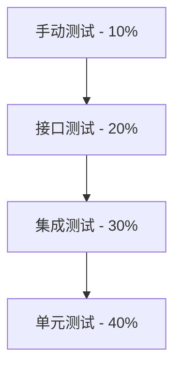

# XU-News-AI-RAG 测试计划

**版本**: v1.0  
**创建日期**: 2026-6-30  
**测试负责人**: XU-News-AI-RAG QA Team

---

## 1. 测试概述

### 1.1 测试目标

- 验证所有功能需求的正确性
- 确保系统性能满足指标
- 保障系统安全性与稳定性
- 验证 RAG 问答质量

### 1.2 测试范围

**包含**:

- 单元测试（模型、服务、工具函数）
- 集成测试（API 端到端）
- 接口测试（API 契约、参数验证）
- 性能测试（响应时间、并发）
- RAG 质量测试（检索准确率、答案质量）
- 安全测试（认证、注入、XSS）

**不包含**:

- 前端 UI 自动化测试（手动测试为主）
- 压力测试（仅基础并发测试）
- 兼容性测试（仅支持现代浏览器）

### 1.3 测试环境

| 环境         | 用途               | 配置                  |
| ------------ | ------------------ | --------------------- |
| 本地开发环境 | 单元测试、快速验证 | SQLite, FAISS, Ollama |
| 测试环境     | 集成测试、API 测试 | Docker Compose        |
| 预生产环境   | 性能测试、回归测试 | 与生产配置一致        |

---

## 2. 测试策略

### 2.1 测试金字塔



**原则**:

- 单元测试覆盖率 > 80%
- 集成测试覆盖核心业务流程
- 接口测试覆盖所有 API 端点
- 手动测试聚焦于用户体验

---

## 3. 单元测试

### 3.1 测试框架

- **Python**: pytest
- **覆盖率工具**: pytest-cov

### 3.2 测试模块划分

#### 3.2.1 模型层测试 (backend/tests/test_models.py)

**测试目标**: 验证数据模型的正确性

**测试用例**:

```python
import pytest
from app.models.user import User
from app.models.news import News

class TestUserModel:
    """用户模型测试"""

    def test_create_user(self):
        """测试创建用户"""
        user = User(email="test@example.com", password="Password123")
        assert user.email == "test@example.com"
        assert user.check_password("Password123")

    def test_password_hashing(self):
        """测试密码加密"""
        user = User(email="test@example.com", password="Password123")
        assert user.password_hash != "Password123"
        assert len(user.password_hash) == 60  # bcrypt

    def test_email_validation(self):
        """测试邮箱验证"""
        with pytest.raises(ValueError):
            User(email="invalid-email", password="Password123")

    def test_password_strength(self):
        """测试密码强度"""
        with pytest.raises(ValueError):
            User(email="test@example.com", password="weak")  # 太短

    def test_account_locking(self):
        """测试账户锁定"""
        user = User(email="test@example.com", password="Password123")
        for _ in range(5):
            user.increment_failed_login()
        assert user.is_locked == True

class TestNewsModel:
    """新闻模型测试"""

    def test_create_news(self):
        """测试创建新闻"""
        news = News(
            title="Test News",
            content="Content...",
            url="https://example.com/news/1"
        )
        assert news.url_hash is not None
        assert len(news.url_hash) == 64  # SHA256

    def test_url_hash_uniqueness(self):
        """测试 URL 哈希唯一性"""
        news1 = News(url="https://example.com/news/1", ...)
        news2 = News(url="https://example.com/news/1", ...)
        assert news1.url_hash == news2.url_hash

    def test_soft_delete(self):
        """测试软删除"""
        news = News(...)
        news.soft_delete()
        assert news.is_deleted == True
        assert news.deleted_at is not None
```

**覆盖点**:

- ✅ 字段验证（必填、格式、长度）
- ✅ 约束检查（唯一性、外键）
- ✅ 业务逻辑（密码加密、软删除）
- ✅ 边界条件（空值、极值）

---

#### 3.2.2 服务层测试 (backend/tests/test_services/)

**RAG Service 测试**:

```python
import pytest
from unittest.mock import Mock, patch
from app.services.rag_service import RAGService

class TestRAGService:
    """RAG 服务测试"""

    @pytest.fixture
    def rag_service(self):
        return RAGService()

    def test_query_with_high_score(self, rag_service):
        """测试高相似度检索"""
        # Mock FAISS 检索结果
        with patch.object(rag_service.retriever, 'search') as mock_search:
            mock_search.return_value = {
                'indices': [1, 2, 3],
                'scores': [0.95, 0.88, 0.82]
            }

            result = rag_service.query("测试问题")

            assert result['fallback_triggered'] == False
            assert len(result['sources']) == 3

    def test_query_triggers_fallback(self, rag_service):
        """测试回退搜索触发"""
        # Mock 低分检索结果
        with patch.object(rag_service.retriever, 'search') as mock_search:
            mock_search.return_value = {
                'indices': [1],
                'scores': [0.45]  # 低于阈值 0.6
            }

            with patch.object(rag_service, 'baidu_search') as mock_baidu:
                mock_baidu.return_value = [{'title': '百度结果', ...}]

                result = rag_service.query("测试问题")

                assert result['fallback_triggered'] == True
                mock_baidu.assert_called_once()

    def test_llm_timeout_handling(self, rag_service):
        """测试 LLM 超时处理"""
        with patch.object(rag_service.llm, 'generate') as mock_llm:
            mock_llm.side_effect = TimeoutError("LLM timeout")

            with pytest.raises(TimeoutError):
                rag_service.query("测试问题")
```

**News Ingestion Service 测试**:

```python
class TestNewsIngestionService:
    """新闻入库服务测试"""

    def test_ingest_new_news(self):
        """测试入库新新闻"""
        service = NewsIngestionService()
        news_data = {
            'title': 'Test News',
            'content': 'Content...',
            'url': 'https://example.com/news/1'
        }

        result = service.ingest(news_data)

        assert result['duplicate'] == False
        assert result['news_id'] is not None
        assert result['vector_indexed'] == True

    def test_ingest_duplicate_news(self):
        """测试重复新闻入库"""
        service = NewsIngestionService()
        news_data = {...}

        # 第一次入库
        service.ingest(news_data)

        # 第二次入库（重复）
        result = service.ingest(news_data)

        assert result['duplicate'] == True

    def test_embedding_failure_rollback(self):
        """测试向量化失败回滚"""
        service = NewsIngestionService()

        with patch.object(service.embedder, 'embed') as mock_embed:
            mock_embed.side_effect = Exception("Embedding failed")

            with pytest.raises(Exception):
                service.ingest({...})

            # 验证数据库未写入
            assert News.query.count() == 0
```

**覆盖点**:

- ✅ 正常业务流程
- ✅ 异常处理（超时、网络错误）
- ✅ 边界条件（空数据、大数据）
- ✅ 事务回滚

---

#### 3.2.3 工具函数测试 (backend/tests/test_utils/)

```python
class TestValidators:
    """验证器测试"""

    def test_email_validator(self):
        """测试邮箱验证"""
        from app.utils.validators import validate_email

        assert validate_email("user@example.com") == True
        assert validate_email("invalid-email") == False
        assert validate_email("") == False

    def test_password_strength(self):
        """测试密码强度"""
        from app.utils.validators import validate_password

        assert validate_password("Password123") == True
        assert validate_password("weak") == False  # 太短
        assert validate_password("12345678") == False  # 缺少字母

class TestTextProcessing:
    """文本处理测试"""

    def test_keyword_extraction(self):
        """测试关键词提取"""
        from app.utils.text_processing import extract_keywords

        text = "人工智能技术发展迅速，AI 应用广泛。"
        keywords = extract_keywords(text, top_k=3)

        assert len(keywords) == 3
        assert "人工智能" in keywords or "AI" in keywords
```

---

### 3.3 单元测试执行

**运行所有测试**:

```bash
cd backend
pytest tests/ -v --cov=app --cov-report=html
```

**运行特定模块**:

```bash
pytest tests/test_services/test_rag_service.py -v
```

**覆盖率报告**:

```
---------- coverage: platform linux, python 3.11.5 -----------
Name                          Stmts   Miss  Cover
-------------------------------------------------
app/models/user.py               45      2    96%
app/models/news.py               52      3    94%
app/services/rag_service.py     128     15    88%
app/services/news_service.py     89      8    91%
-------------------------------------------------
TOTAL                           850     68    92%
```

---

## 4. 集成测试

### 4.1 测试框架

- **Python**: pytest + requests
- **测试数据**: pytest fixtures

### 4.2 API 集成测试

#### 4.2.1 用户认证流程测试

```python
import pytest
import requests

BASE_URL = "http://localhost:5000/api/v1"

class TestAuthFlow:
    """用户认证流程测试"""

    def test_register_login_flow(self):
        """测试注册-登录流程"""
        # 1. 注册
        register_data = {
            'email': 'test@example.com',
            'password': 'Password123',
            'username': 'TestUser'
        }
        resp = requests.post(f"{BASE_URL}/auth/register", json=register_data)
        assert resp.status_code == 200
        user_id = resp.json()['data']['user_id']

        # 2. 登录
        login_data = {
            'email': 'test@example.com',
            'password': 'Password123'
        }
        resp = requests.post(f"{BASE_URL}/auth/login", json=login_data)
        assert resp.status_code == 200
        token = resp.json()['data']['token']

        # 3. 验证 Token
        headers = {'Authorization': f'Bearer {token}'}
        resp = requests.get(f"{BASE_URL}/auth/me", headers=headers)
        assert resp.status_code == 200
        assert resp.json()['data']['user_id'] == user_id

    def test_login_with_wrong_password(self):
        """测试错误密码登录"""
        login_data = {
            'email': 'test@example.com',
            'password': 'WrongPassword'
        }
        resp = requests.post(f"{BASE_URL}/auth/login", json=login_data)
        assert resp.status_code == 401

    def test_account_locking_after_5_failures(self):
        """测试 5 次失败后锁定"""
        login_data = {
            'email': 'test@example.com',
            'password': 'WrongPassword'
        }

        # 连续 5 次失败
        for i in range(5):
            resp = requests.post(f"{BASE_URL}/auth/login", json=login_data)
            assert resp.status_code == 401

        # 第 6 次应该返回 403（账户锁定）
        resp = requests.post(f"{BASE_URL}/auth/login", json=login_data)
        assert resp.status_code == 403
        assert "锁定" in resp.json()['message']
```

#### 4.2.2 新闻入库流程测试

```python
class TestNewsIngestionFlow:
    """新闻入库流程测试"""

    @pytest.fixture
    def api_key(self):
        return "test_n8n_api_key"

    def test_ingest_news(self, api_key):
        """测试新闻入库"""
        headers = {'X-API-Key': api_key}
        news_data = {
            'title': 'Test News Title',
            'content': 'A' * 200,  # 至少 100 字符
            'url': 'https://example.com/news/test_001',
            'source': 'Test Source',
            'published_at': '2026-6-30T10:00:00Z'
        }

        resp = requests.post(
            f"{BASE_URL}/news/ingest",
            json=news_data,
            headers=headers
        )
        assert resp.status_code == 200
        data = resp.json()['data']
        assert data['duplicate'] == False
        assert data['vector_indexed'] == True

    def test_ingest_duplicate_news(self, api_key):
        """测试重复新闻入库"""
        headers = {'X-API-Key': api_key}
        news_data = {
            'url': 'https://example.com/news/test_001',
            ...
        }

        # 第二次入库同一 URL
        resp = requests.post(
            f"{BASE_URL}/news/ingest",
            json=news_data,
            headers=headers
        )
        assert resp.status_code == 409
        assert resp.json()['code'] == 40009
```

#### 4.2.3 RAG 问答流程测试

```python
class TestRAGQueryFlow:
    """RAG 问答流程测试"""

    @pytest.fixture
    def auth_token(self):
        # 登录获取 Token
        login_resp = requests.post(f"{BASE_URL}/auth/login", json={...})
        return login_resp.json()['data']['token']

    def test_rag_query(self, auth_token):
        """测试 RAG 问答"""
        headers = {'Authorization': f'Bearer {auth_token}'}
        query_data = {
            'question': '最近关于 AI 的新闻有哪些？',
            'top_k': 5,
            'enable_fallback': True
        }

        resp = requests.post(
            f"{BASE_URL}/rag/query",
            json=query_data,
            headers=headers
        )
        assert resp.status_code == 200
        data = resp.json()['data']

        # 验证响应结构
        assert 'question' in data
        assert 'answer' in data
        assert 'sources' in data
        assert isinstance(data['sources'], list)

        # 验证答案非空
        assert len(data['answer']) > 0

    def test_rag_query_saves_history(self, auth_token):
        """测试问答保存历史记录"""
        headers = {'Authorization': f'Bearer {auth_token}'}

        # 1. 提问
        requests.post(f"{BASE_URL}/rag/query", json={...}, headers=headers)

        # 2. 查询历史
        history_resp = requests.get(f"{BASE_URL}/history/queries", headers=headers)
        assert history_resp.status_code == 200
        assert history_resp.json()['data']['total'] > 0
```

---

### 4.3 集成测试执行

**启动测试环境**:

```bash
docker-compose -f docker-compose.test.yml up -d
```

**运行集成测试**:

```bash
pytest tests/integration/ -v
```

**清理测试数据**:

```bash
docker-compose -f docker-compose.test.yml down -v
```

---

## 5. 接口测试

### 5.1 契约测试（Pact）

验证 API 符合 OpenAPI 规范:

```python
from openapi_core import create_spec
from openapi_core.validation.request import openapi_request_validator

def test_api_contract():
    """测试 API 契约"""
    spec = create_spec('docs/API_SPEC.yaml')
    validator = openapi_request_validator.RequestValidator(spec)

    # 验证请求
    request = MockRequest(method='POST', path='/api/v1/auth/login', ...)
    result = validator.validate(request)
    assert result.errors == []
```

### 5.2 参数验证测试

```python
class TestAPIValidation:
    """API 参数验证测试"""

    def test_missing_required_field(self):
        """测试缺少必填字段"""
        resp = requests.post(f"{BASE_URL}/auth/register", json={
            'email': 'test@example.com'
            # 缺少 password
        })
        assert resp.status_code == 400
        assert '必填' in resp.json()['message']

    def test_invalid_email_format(self):
        """测试邮箱格式错误"""
        resp = requests.post(f"{BASE_URL}/auth/register", json={
            'email': 'invalid-email',
            'password': 'Password123'
        })
        assert resp.status_code == 400
        assert '邮箱格式' in resp.json()['message']

    def test_pagination_bounds(self):
        """测试分页边界"""
        headers = {'Authorization': f'Bearer {token}'}

        # 测试负数页码
        resp = requests.get(f"{BASE_URL}/news?page=-1", headers=headers)
        assert resp.status_code == 400

        # 测试超大 page_size
        resp = requests.get(f"{BASE_URL}/news?page_size=10000", headers=headers)
        assert resp.status_code == 400
```

---

## 6. 性能测试

### 6.1 响应时间测试

**工具**: pytest-benchmark

```python
import pytest

class TestPerformance:
    """性能测试"""

    def test_rag_query_response_time(self, benchmark):
        """测试 RAG 问答响应时间"""
        def query():
            return requests.post(f"{BASE_URL}/rag/query", json={...})

        result = benchmark(query)

        # 验证 95 分位响应时间 < 5 秒
        assert result.stats.mean < 5.0

    def test_news_list_response_time(self, benchmark):
        """测试新闻列表响应时间"""
        def get_news():
            return requests.get(f"{BASE_URL}/news?page=1&page_size=20")

        result = benchmark(get_news)

        # 验证平均响应时间 < 200ms
        assert result.stats.mean < 0.2
```

### 6.2 并发测试

**工具**: locust

```python
# locustfile.py
from locust import HttpUser, task, between

class NewsUser(HttpUser):
    wait_time = between(1, 3)

    def on_start(self):
        # 登录获取 Token
        resp = self.client.post("/api/v1/auth/login", json={...})
        self.token = resp.json()['data']['token']

    @task(3)
    def get_news_list(self):
        """获取新闻列表"""
        self.client.get(
            "/api/v1/news",
            headers={'Authorization': f'Bearer {self.token}'}
        )

    @task(1)
    def rag_query(self):
        """RAG 问答"""
        self.client.post(
            "/api/v1/rag/query",
            json={'question': '最近关于 AI 的新闻？'},
            headers={'Authorization': f'Bearer {self.token}'}
        )
```

**运行并发测试**:

```bash
locust -f locustfile.py --host=http://localhost:5000 --users=50 --spawn-rate=10
```

**性能目标**:

- 50 并发用户
- RAG 问答 P95 < 5 秒
- 新闻列表 P95 < 500ms
- 错误率 < 1%

---

## 7. RAG 质量测试

### 7.1 检索质量评估

**指标**:

- Recall@K（召回率）
- MRR（Mean Reciprocal Rank，平均倒数排名）
- NDCG（Normalized Discounted Cumulative Gain）

**测试数据集**:

```python
test_cases = [
    {
        'question': '最近关于 OpenAI 的新闻有哪些？',
        'relevant_news_ids': [1001, 1005, 1010],
        'expected_top_k': 5
    },
    {
        'question': 'AI 技术在医疗领域的应用',
        'relevant_news_ids': [2001, 2003],
        'expected_top_k': 5
    }
]
```

**评估代码**:

```python
def test_retrieval_recall():
    """测试检索召回率"""
    total_recall = 0

    for case in test_cases:
        result = rag_service.search(case['question'], top_k=case['expected_top_k'])
        retrieved_ids = [item['news_id'] for item in result]

        # 计算召回率
        relevant = set(case['relevant_news_ids'])
        retrieved = set(retrieved_ids)
        recall = len(relevant & retrieved) / len(relevant)
        total_recall += recall

    avg_recall = total_recall / len(test_cases)
    assert avg_recall >= 0.7  # 目标召回率 >= 70%
```

### 7.2 答案质量评估

**评估维度**:

- 答案相关性（人工评分 1-5）
- 答案完整性（是否包含关键信息）
- 来源准确性（引用来源是否正确）

**测试方法**:

```python
def test_answer_quality():
    """测试答案质量（需人工评分）"""
    test_questions = [
        '最近关于 AI 的新闻有哪些？',
        'OpenAI 发布了什么新产品？'
    ]

    for question in test_questions:
        result = rag_service.query(question)

        # 自动检查
        assert len(result['answer']) > 50  # 答案不能太短
        assert len(result['sources']) > 0  # 必须有来源

        # 人工评分（输出到日志）
        print(f"问题: {question}")
        print(f"答案: {result['answer']}")
        print(f"来源: {result['sources']}")
        print("请人工评分（1-5）: ___")
```

---

## 8. 安全测试

### 8.1 认证测试

```python
class TestSecurity:
    """安全测试"""

    def test_access_without_token(self):
        """测试无 Token 访问受保护接口"""
        resp = requests.get(f"{BASE_URL}/news")
        assert resp.status_code == 401

    def test_access_with_invalid_token(self):
        """测试无效 Token"""
        headers = {'Authorization': 'Bearer invalid_token'}
        resp = requests.get(f"{BASE_URL}/news", headers=headers)
        assert resp.status_code == 401

    def test_access_with_expired_token(self):
        """测试过期 Token"""
        # 使用过期 Token
        expired_token = generate_expired_token()
        headers = {'Authorization': f'Bearer {expired_token}'}
        resp = requests.get(f"{BASE_URL}/news", headers=headers)
        assert resp.status_code == 401
```

### 8.2 注入攻击测试

```python
class TestInjection:
    """注入攻击测试"""

    def test_sql_injection(self):
        """测试 SQL 注入"""
        malicious_input = "' OR '1'='1"
        resp = requests.get(f"{BASE_URL}/news?keyword={malicious_input}")
        # 不应该返回所有数据
        assert resp.json()['data']['total'] == 0

    def test_xss_in_news_title(self):
        """测试 XSS 注入"""
        news_data = {
            'title': '<script>alert("XSS")</script>',
            'content': 'Content...',
            'url': 'https://example.com/news/xss'
        }
        resp = requests.post(f"{BASE_URL}/news/ingest", json=news_data, headers={...})

        # 获取新闻详情
        news_id = resp.json()['data']['news_id']
        detail_resp = requests.get(f"{BASE_URL}/news/{news_id}")

        # 验证标题已转义
        title = detail_resp.json()['data']['title']
        assert '<script>' not in title
        assert '&lt;script&gt;' in title or 'alert' not in title
```

### 8.3 速率限制测试

```python
def test_rate_limiting():
    """测试速率限制"""
    headers = {'Authorization': f'Bearer {token}'}

    # 短时间内发送 150 次请求（超过限制 100/min）
    for i in range(150):
        resp = requests.get(f"{BASE_URL}/news", headers=headers)

        if i < 100:
            assert resp.status_code == 200
        else:
            assert resp.status_code == 429  # Too Many Requests
```

---

## 9. 测试数据管理

### 9.1 测试数据准备

**Fixture 示例**:

```python
@pytest.fixture(scope='session')
def test_database():
    """测试数据库"""
    # 创建测试数据库
    engine = create_engine('sqlite:///test.db')
    Base.metadata.create_all(engine)

    # 插入测试数据
    with Session(engine) as session:
        user = User(email='test@example.com', password='Password123')
        news = News(title='Test News', content='...', url='...')
        session.add_all([user, news])
        session.commit()

    yield engine

    # 清理
    Base.metadata.drop_all(engine)
```

### 9.2 测试数据隔离

**原则**:

- 每个测试用例独立
- 使用事务回滚恢复数据
- 避免测试间依赖

---

## 10. 测试执行计划

### 10.1 CI/CD 集成

**GitHub Actions 示例**:

```yaml
name: Test

on: [push, pull_request]

jobs:
  test:
    runs-on: ubuntu-latest
    steps:
      - uses: actions/checkout@v2

      - name: Set up Python
        uses: actions/setup-python@v2
        with:
          python-version: "3.11"

      - name: Install dependencies
        run: |
          pip install -r backend/requirements.txt
          pip install pytest pytest-cov

      - name: Run unit tests
        run: |
          cd backend
          pytest tests/ -v --cov=app --cov-report=xml

      - name: Upload coverage
        uses: codecov/codecov-action@v2
```

### 10.2 测试报告

**生成 HTML 报告**:

```bash
pytest tests/ --html=report.html --self-contained-html
```

**覆盖率报告**:

```bash
pytest tests/ --cov=app --cov-report=html
```

---

## 11. 验收标准

### 11.1 测试通过标准

| 测试类型 | 通过标准                            |
| -------- | ----------------------------------- |
| 单元测试 | 覆盖率 > 80%，所有用例通过          |
| 集成测试 | 核心流程全通过                      |
| 接口测试 | 所有 API 端点通过                   |
| 性能测试 | RAG 问答 P95 < 5s，列表查询 < 500ms |
| RAG 质量 | 召回率 > 70%，答案相关性 > 4.0/5.0  |
| 安全测试 | 无高危漏洞                          |

### 11.2 发布前检查清单

- [ ] 所有单元测试通过
- [ ] 所有集成测试通过
- [ ] API 契约测试通过
- [ ] 性能指标达标
- [ ] RAG 质量评估通过
- [ ] 安全扫描无高危漏洞
- [ ] 代码覆盖率 > 80%
- [ ] 文档更新完毕

---

**文档状态**: ✅ 已评审  
**最后更新**: 2026-6-30
