# XU-News-AI-RAG 系统架构文档

**版本**: v2.0  
**创建日期**: 2026-6-30  
**最后更新**: 2026-7-11  
**架构师**: XU-News-AI-RAG Team

---

## 1. 架构概述

XU-News-AI-RAG 采用前后端分离的 Monorepo 架构，结合工作流自动化、向量检索、大语言模型，构建智能新闻检索与问答系统。

### 1.1 设计原则

- **模块化**: 各模块职责清晰，松耦合
- **可扩展**: 支持水平扩展与功能扩展
- **高性能**: 向量检索 + 缓存机制
- **安全性**: 认证鉴权 + 数据加密
- **可观测**: 日志、监控、追踪
- **Agent化**: 智能代理能力封装，Skill/Tool 统一开发规范

---

## 2. 系统架构图

### 2.1 整体架构

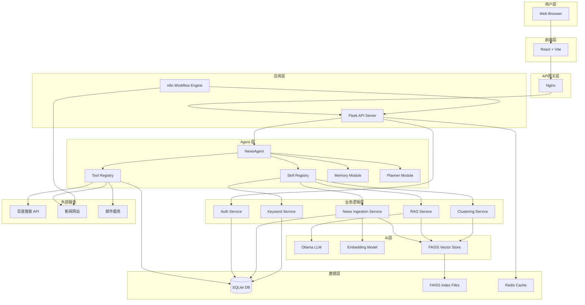

### 2.2 Agent Skill 框架架构

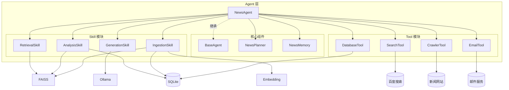

### 2.3 技术栈分层

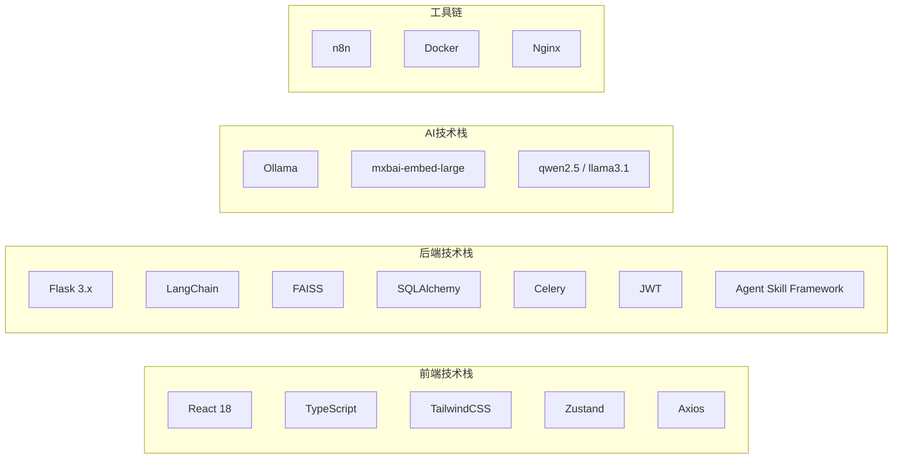

---

## 3. 模块职责详解

### 3.1 前端模块 (Frontend)

**技术**: React 18 + Vite + TypeScript

**职责**:

- 用户界面渲染
- 用户交互处理
- API 调用封装
- 状态管理
- 路由管理

**核心页面**:

```
/login          - 登录页
/register       - 注册页
/dashboard      - 仪表盘（数据概览）
/chat           - RAG 问答界面
/news           - 新闻列表与检索
/cluster        - 聚类分析可视化
/keywords       - 关键词统计
/history        - 历史记录
/settings       - 用户设置
```

**组件结构**:

```
/components
  /common       - 通用组件（Button, Input, Modal）
  /layout       - 布局组件（Header, Sidebar, Footer）
  /chat         - 聊天相关组件（MessageList, InputBox）
  /news         - 新闻相关组件（NewsCard, NewsFilter）
  /charts       - 图表组件（ClusterChart, KeywordCloud）
```

---

### 3.2 后端模块 (Backend)

**技术**: Flask + LangChain + FAISS + SQLite + Agent Skill Framework

#### 3.2.1 API Server

**职责**:

- RESTful API 提供
- 请求路由与参数验证
- 认证鉴权中间件
- 错误处理与日志

**目录结构**:

```
/app
  /api
    /v1
      auth.py           - 认证接口
      news.py           - 新闻管理接口
      rag.py            - RAG 问答接口
      cluster.py        - 聚类分析接口
      keyword.py        - 关键词统计接口
      history.py        - 历史记录接口
      agent_api.py      - Agent 统一接口
  /agent
    base_agent.py       - Agent 基类
    news_agent.py       - NewsAgent 实现类
    memory.py           - 记忆模块
    planner.py          - 规划器模块
    __init__.py         - 模块导出
    /skills
      __init__.py
      base_skill.py     - Skill 基类
      retrieval_skill.py - 检索 Skill
      generation_skill.py - 生成 Skill
      analysis_skill.py - 分析 Skill
      ingestion_skill.py - 入库 Skill
    /tools
      __init__.py
      base_tool.py      - Tool 基类
      search_tool.py    - 搜索工具
      crawler_tool.py   - 爬虫工具
      database_tool.py  - 数据库工具
      email_tool.py     - 邮件工具
  /models
    user.py             - 用户模型
    news.py             - 新闻模型
    history.py          - 历史记录模型
  /services
    auth_service.py     - 认证业务逻辑
    news_service.py     - 新闻业务逻辑
    rag_service.py      - RAG 业务逻辑
    cluster_service.py  - 聚类业务逻辑
    keyword_service.py  - 关键词业务逻辑
  /core
    embeddings.py       - Embedding 封装
    vectorstore.py      - FAISS 封装
    llm.py              - Ollama 客户端
    reranker.py         - 重排序器
    rag.py              - RAG 核心逻辑
  /utils
    validators.py       - 参数验证
    decorators.py       - 装饰器（认证、限流）
    logger.py           - 日志工具
  /config
    config.py           - 配置管理
```

#### 3.2.2 Agent Skill 框架模块

##### BaseAgent

```python
class BaseAgent:
    def __init__(self):
        self.skills: Dict[str, BaseSkill] = {}
        self.tools: Dict[str, BaseTool] = {}
        self.memory: Optional[BaseMemory] = None
        self.planner: Optional[BasePlanner] = None
    
    def register_skill(self, name: str, skill):
        self.skills[name] = skill
    
    def register_tool(self, name: str, tool):
        self.tools[name] = tool
    
    def execute(self, task: str, context: Optional[Dict] = None) -> Dict:
        # 执行任务逻辑
```

**职责**:

- 定义 Agent 的基本接口
- Skill/Tool 注册与管理
- 任务执行调度
- 记忆与规划器集成

##### NewsAgent

**职责**:

- 新闻领域智能代理
- 注册并管理核心 Skill 和 Tool
- 封装 RAG 问答流程
- 执行聚类分析、关键词统计等任务

##### NewsPlanner

**职责**:

- 任务类型分类（问答、分析、入库）
- 执行计划生成
- Skill/Tool 选择与调度
- 步骤排序与依赖处理

##### NewsMemory

**职责**:

- 对话历史管理
- 用户画像存储
- 上下文记忆
- 持久化存储（SQLite）

##### Skill 模块

| Skill 名称 | 职责 | 核心方法 |
|-----------|------|---------|
| **RetrievalSkill** | 语义检索与重排序 | `search()`, `rerank()`, `hybrid_search()` |
| **GenerationSkill** | LLM 生成与摘要 | `generate()`, `summarize()`, `extract_keywords()` |
| **AnalysisSkill** | 聚类分析与统计 | `cluster_analysis()`, `keyword_statistics()`, `trend_analysis()` |
| **IngestionSkill** | 数据入库与去重 | `ingest_structured()`, `ingest_unstructured()`, `batch_ingest()` |

##### Tool 模块

| Tool 名称 | 职责 | 核心方法 |
|-----------|------|---------|
| **SearchTool** | 外部搜索 | `search_baidu()`, `search_rss()`, `search_local()` |
| **CrawlerTool** | 网页抓取 | `crawl_page()`, `check_robots()`, `extract_content()` |
| **DatabaseTool** | 数据库操作 | `query()`, `insert()`, `update()`, `delete()` |
| **EmailTool** | 邮件发送 | `send_email()`, `send_notification()`, `send_report()` |

#### 3.2.3 核心服务职责

##### Auth Service

- 用户注册（密码加密、邮箱验证）
- 用户登录（JWT Token 签发）
- Token 验证与刷新
- 密码重置
- 账户锁定机制

##### News Ingestion Service

- 接收 n8n 爬取的新闻数据
- 数据清洗与标准化
- 去重检测（URL Hash）
- 存储到 SQLite
- 调用 Embedding 生成向量
- 更新 FAISS 索引
- 返回入库状态

##### RAG Service

- 接收用户问题
- 调用 Embedding 模型向量化问题
- 在 FAISS 中检索 Top-K 相关新闻
- 评估检索质量（相似度阈值）
- 触发回退搜索（百度 API）
- 构建 LangChain Prompt
- 调用 Ollama 生成答案
- 格式化返回（答案 + 来源引用）
- 记录问答历史

##### Clustering Service

- 筛选指定时间范围的新闻
- 从 FAISS 读取向量
- 执行聚类算法（K-Means/DBSCAN）
- 主题标签生成（关键词提取或 LLM 总结）
- 生成可视化数据（t-SNE 降维）
- 导出报告

##### Keyword Service

- 时间维度筛选新闻
- 文本预处理（分词、去停用词）
- 关键词提取（TF-IDF/TextRank）
- 频次统计与排序
- 返回 Top10 关键词

---

### 3.3 工作流模块 (n8n)

**职责**:

- 定时任务调度
- HTTP 请求发起
- HTML 解析
- 数据转换
- API 回调

**工作流示例**:

#### Workflow 1: 新闻爬取

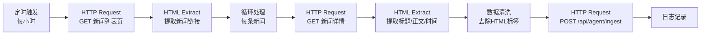

#### Workflow 2: 异常监控

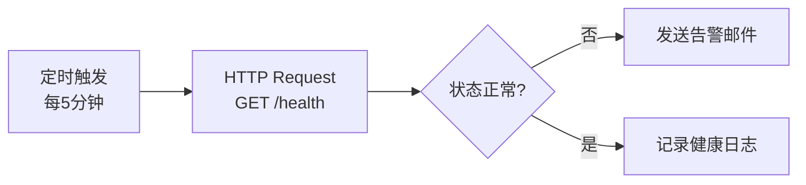

---

### 3.4 AI 模块

#### 3.4.1 Ollama LLM

**作用**: 本地大语言模型推理

**推荐模型**:

- `qwen2.5:7b` - 中文优化，适合问答
- `llama3.1:8b` - 综合性能好
- `gemma2:9b` - 轻量级

**API 调用示例**:

```python
import requests

response = requests.post(
    "http://127.0.0.1:11434/api/generate",
    json={
        "model": "qwen2.5:7b",
        "prompt": "基于以下新闻回答问题...",
        "stream": False
    }
)
```

#### 3.4.2 Embedding Model

**作用**: 文本向量化

**推荐模型**:

- `mxbai-embed-large` - 高质量通用向量（1024维）
- `nomic-embed-text` - 轻量级（768维）

**向量化流程**:

```python
from langchain_community.embeddings import OllamaEmbeddings

embeddings = OllamaEmbeddings(model="mxbai-embed-large")
vector = embeddings.embed_query("文本内容")
```

#### 3.4.3 FAISS Vector Store

**作用**: 高效向量检索

**索引类型**:

- `IndexFlatL2` - 精确检索（小数据量 < 10万）
- `IndexIVFFlat` - 倒排索引（大数据量 > 10万）

**检索流程**:

```python
import faiss
import numpy as np

# 加载索引
index = faiss.read_index("news_vectors.index")

# 检索 Top-K
query_vector = np.array([...]).astype('float32')
distances, indices = index.search(query_vector, k=5)
```

---

## 4. 数据流详解

### 4.1 新闻入库流程

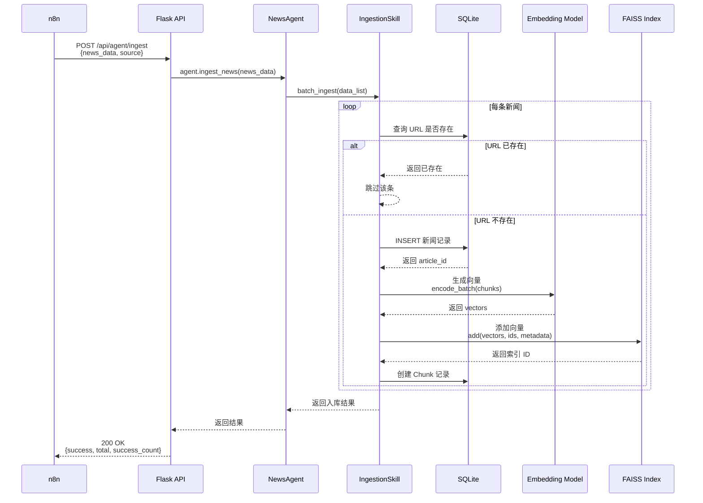

### 4.2 Agent RAG 问答流程

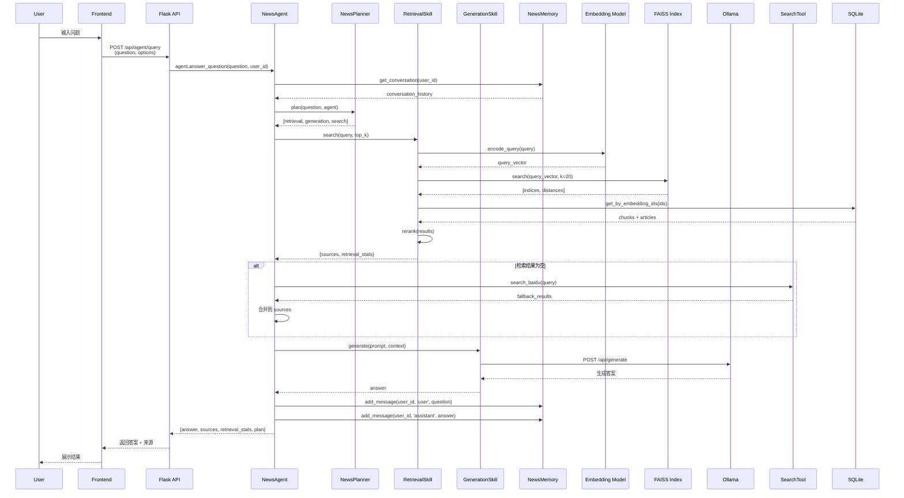

### 4.3 聚类分析流程

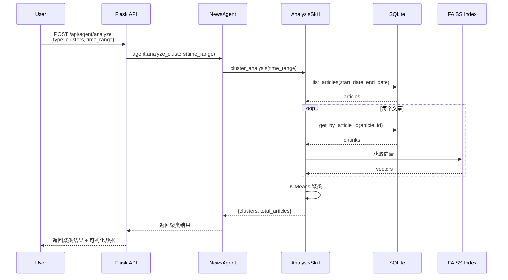

---

## 5. 鉴权流程

### 5.1 JWT 认证流程

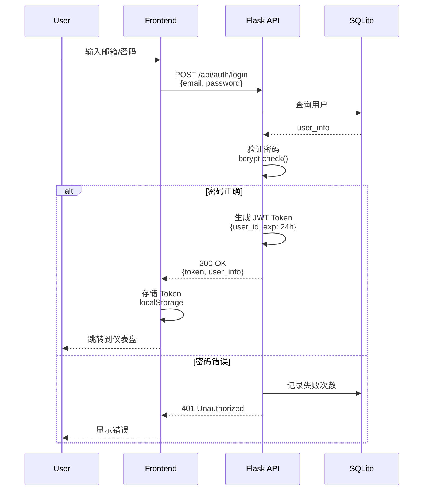

### 5.2 API 请求鉴权

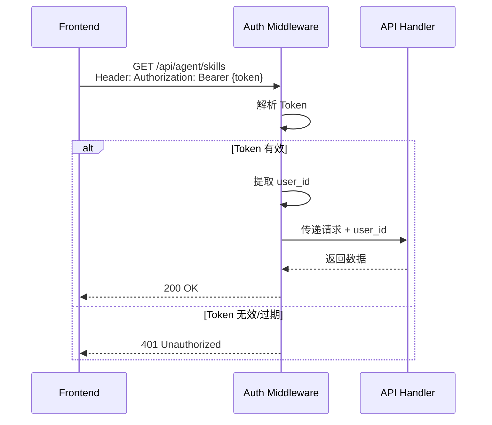

---

## 6. 扩展性设计

### 6.1 Agent Skill 扩展

**新增 Skill**:

```python
from agent.skills.base_skill import BaseSkill

class CustomSkill(BaseSkill):
    def __init__(self):
        super().__init__()
    
    def execute(self, **kwargs) -> Any:
        # 实现自定义技能逻辑
        pass
```

**注册到 Agent**:

```python
from agent.news_agent import NewsAgent

agent = NewsAgent()
agent.register_skill('custom', CustomSkill())
```

**新增 Tool**:

```python
from agent.tools.base_tool import BaseTool

class CustomTool(BaseTool):
    def __init__(self):
        super().__init__()
    
    def execute(self, **kwargs) -> Any:
        # 实现自定义工具逻辑
        pass
```

**注册到 Agent**:

```python
agent.register_tool('custom', CustomTool())
```

### 6.2 水平扩展

**前端**:

- 静态文件通过 CDN 分发
- Nginx 负载均衡

**后端**:

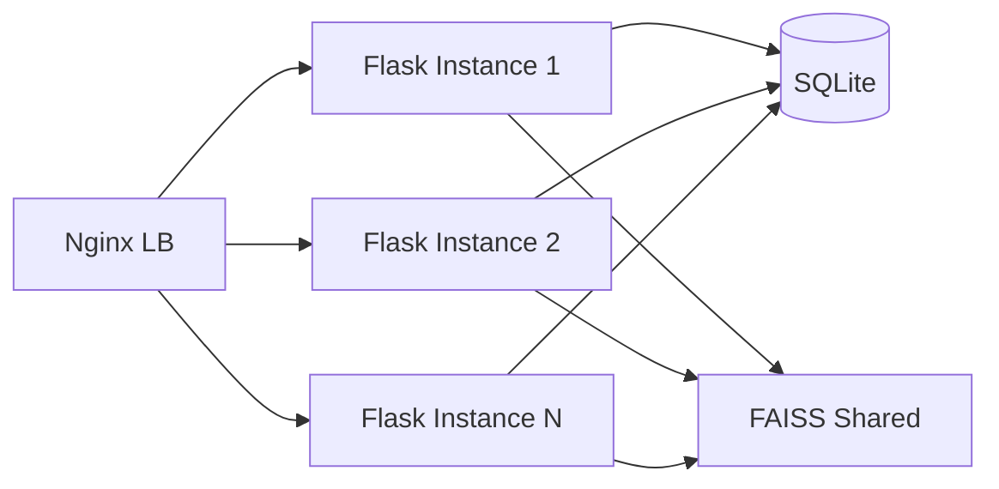

**注意**: SQLite 不支持高并发写入，建议迁移到 PostgreSQL/MySQL

### 6.3 缓存策略

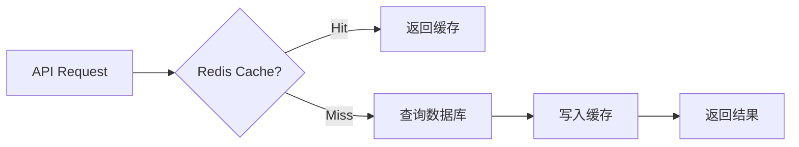

**缓存场景**:

- 热门问答结果（TTL: 1小时）
- 关键词统计（TTL: 30分钟）
- 新闻列表（TTL: 5分钟）

### 6.4 异步任务

使用 Celery 处理耗时操作:

- 批量新闻入库
- 聚类分析
- 报告生成

```python
# tasks.py
@celery.task
def batch_ingest_news(news_list):
    for news in news_list:
        # 入库逻辑
        pass
```

---

## 7. 监控与可观测性

### 7.1 健康检查

```python
@app.route('/health')
def health_check():
    return {
        "status": "healthy",
        "services": {
            "database": check_db(),
            "faiss": check_faiss(),
            "ollama": check_ollama()
        }
    }
```

### 7.2 日志架构

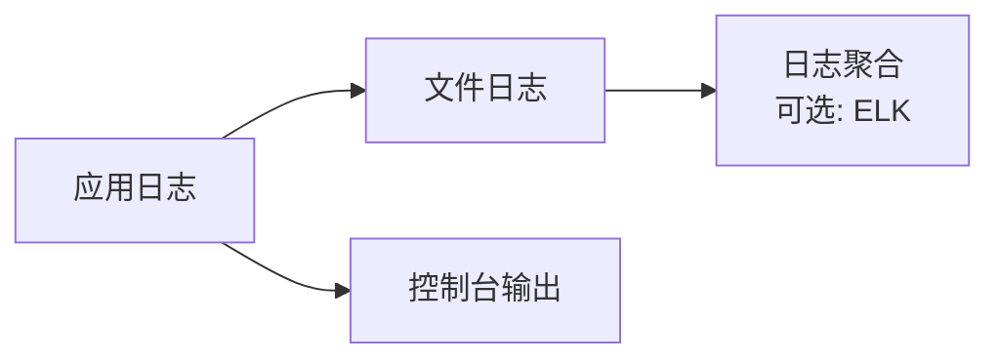

**日志级别**:

- DEBUG: 详细调试信息
- INFO: 常规操作（入库、查询）
- WARNING: 警告（检索质量不足、回退搜索）
- ERROR: 错误（API 调用失败、数据库异常）

### 7.3 监控指标

**系统指标**:

- CPU/内存使用率
- 磁盘空间
- 网络流量

**应用指标**:

- API 请求量（QPS）
- 响应时间（P50/P95/P99）
- 错误率
- 数据库连接数

**业务指标**:

- 新闻入库量（条/小时）
- RAG 问答次数
- 回退搜索触发率
- 用户活跃度

---

## 8. 安全架构

### 8.1 网络安全

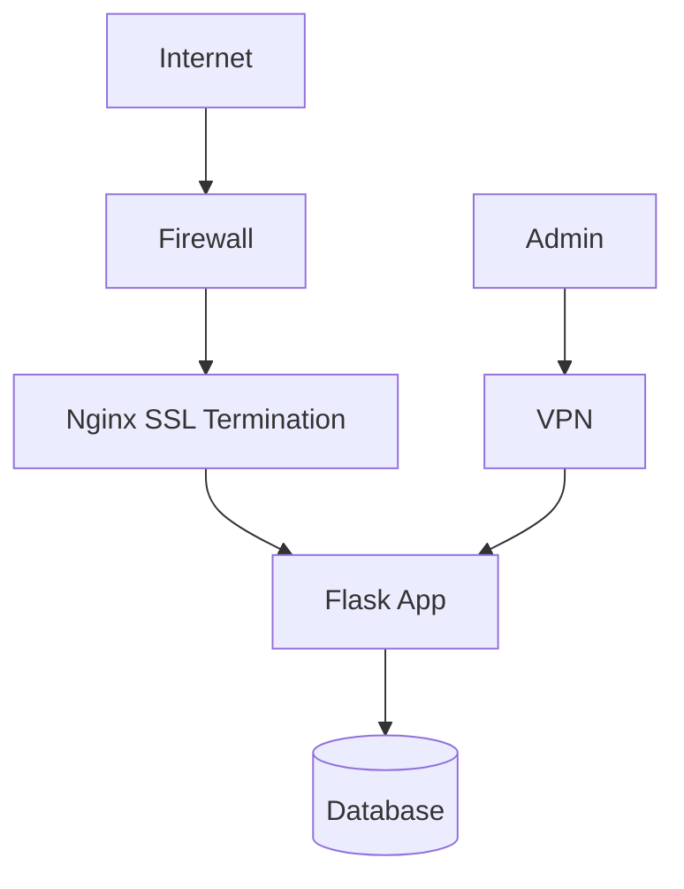

### 8.2 数据安全

**传输加密**:

- HTTPS (TLS 1.3)
- WebSocket over SSL

**存储加密**:

- 密码: bcrypt (cost=12)
- 敏感配置: 环境变量
- 数据库: 可选加密（SQLCipher）

### 8.3 API 安全

**防护措施**:

- JWT 认证
- 速率限制（100 次/分钟/用户）
- CORS 白名单
- SQL 注入防护（参数化查询）
- XSS 防护（输入转义）

---

## 9. 部署架构

### 9.1 单机部署（推荐用于 MVP）

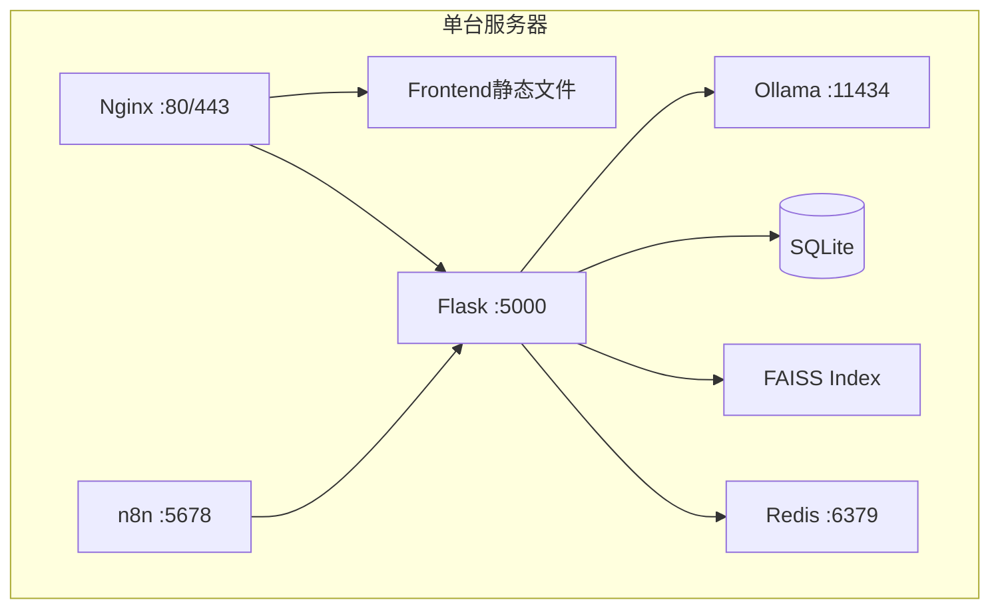

### 9.2 Docker Compose 部署

```yaml
version: "3.8"
services:
  nginx:
    image: nginx:alpine
    ports: [80:80, 443:443]

  frontend:
    build: ./frontend

  backend:
    build: ./backend
    ports: [5000:5000]
    depends_on: [redis, ollama]

  ollama:
    image: ollama/ollama
    ports: [11434:11434]
    volumes: [ollama_data:/root/.ollama]

  n8n:
    image: n8nio/n8n
    ports: [5678:5678]

  redis:
    image: redis:alpine
    ports: [6379:6379]
```

---

## 10. 技术选型理由

| 技术          | 理由                         |
| ------------- | ---------------------------- |
| **React**     | 生态成熟、组件化、性能好     |
| **Vite**      | 开发体验佳、构建速度快       |
| **Flask**     | 轻量级、易于集成 LangChain   |
| **LangChain** | RAG 开发框架、组件丰富       |
| **FAISS**     | 高效向量检索、支持大规模索引 |
| **SQLite**    | 零配置、适合中小规模数据     |
| **Ollama**    | 本地部署、隐私保护、成本低   |
| **n8n**       | 可视化工作流、易于维护       |
| **Docker**    | 环境一致性、部署便捷         |
| **Agent Skill Framework** | 智能代理能力封装、统一开发规范、易于扩展 |

---

## 11. Agent API 接口列表

| 接口 | 方法 | 描述 |
|------|------|------|
| `/api/agent/query` | POST | Agent 智能问答 |
| `/api/agent/analyze` | POST | Agent 分析（聚类/关键词/趋势） |
| `/api/agent/ingest` | POST | Agent 批量入库 |
| `/api/agent/memory` | GET | 获取对话历史 |
| `/api/agent/memory` | DELETE | 清空对话历史 |
| `/api/agent/skills` | GET | 获取已注册 Skill 列表 |
| `/api/agent/tools` | GET | 获取已注册 Tool 列表 |

---

## 12. 未来演进方向

### 12.1 短期优化（1-3 个月）

- 引入 PostgreSQL 替代 SQLite
- 增加 Redis 缓存层
- 前端国际化（i18n）
- 移动端适配

### 12.2 中期扩展（3-6 个月）

- 多模态支持（图片新闻）
- 实时新闻推送（WebSocket）
- 用户个性化推荐
- 分布式爬虫（Scrapy）

### 12.3 长期规划（6-12 个月）

- 微服务化改造
- Kubernetes 部署
- 多租户支持
- 数据湖集成
- Agent 多轮对话能力增强

---

**文档状态**: ✅ 已评审  
**最后更新**: 2026-7-11
